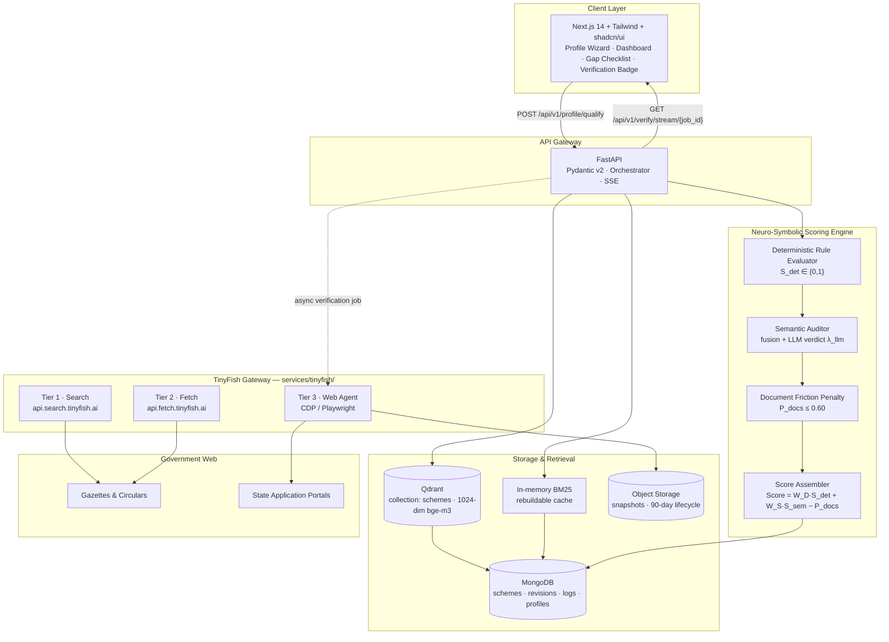
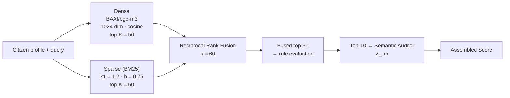
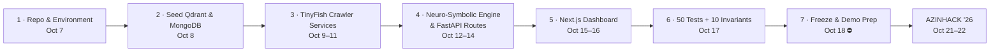

<div align="center">

# 📡 SchemeRadar

### *India's Neuro-Symbolic Engine for Civic Entitlement Discovery & Live Link Verification*

**Find every government scheme you qualify for — in 60 seconds, with a link that actually works.**

[](https://github.com/patchyevolve/schemeradar)
[](#-submission-context)
[](#-the-specification-suite)
[](#-tinyfish-3-tier-integration)
[](#-repository-status)

**Neuro-Symbolic Scoring** · **Hybrid Retrieval (Dense + BM25)** · **Fail-closed Indexing** · **60-minute Link Freshness**

</div>

---

## Table of Contents

1. [Repository Status](#-repository-status)
2. [Problem & Solution](#-problem--solution)
3. [System Architecture](#-system-architecture)
4. [The Neuro-Symbolic Engine](#-the-neuro-symbolic-engine)
5. [Hybrid Search](#-hybrid-search)
6. [TinyFish 3-Tier Integration](#-tinyfish-3-tier-integration)
7. [API Surface](#-api-surface)
8. [Proof It Works](#-proof-it-works)
9. [Quickstart / Local Setup](#-quickstart--local-setup)
10. [Testing & Invariants](#-testing--invariants)
11. [The Specification Suite](#-the-specification-suite)
12. [Roadmap](#-roadmap)
13. [Submission Context](#-submission-context)

---

## 📌 Repository Status

| | |
|---|---|
| **Current contents** | A complete, cross-validated **engineering specification suite** — 5 documents, ~3,800 lines, zero application source code. |
| **What is frozen** | Architecture, data model, workflow, test matrix, and pitch deck. Every constant, entity name, formula and threshold is bound across all five documents. |
| **What comes next** | Implementation, sequenced day-by-day against the **October 18, 2026** freeze date → [`docs/BUILD_ORDER.md`](docs/BUILD_ORDER.md) |
| **Validation** | Automated validators confirm schema conformance, arithmetic invariants, term freezing and cross-document numeric consistency. All green. |

> **Why spec-first?** In civic tech, a wrong eligibility answer is not a bug — it is a harm. We froze the rules, the numbers and the failure behaviour *before* writing a line of implementation, so the 50 acceptance tests in Phase 3 are written against an agreed contract rather than against whatever the code happens to do.

---

## 💔 Problem & Solution

### The Problem

India allocates over **₹1.4 Lakh Crore+** per year to welfare schemes — scholarships, fee reimbursement, farmer income support, healthcare. **More than 65%** of the citizens those schemes were written for never claim a rupee.

Not because the schemes don't exist. Three walls stop them:

| # | Wall | What it looks like |
|---|------|--------------------|
| 1 | **Fragmentation** | Hundreds of unlinked state and central portals (Delhi e-District, Haryana Antyodaya-SARAL, NSP) that defeat standard crawlers — **ASP.NET postbacks**, session-locked forms, JavaScript-rendered tables. |
| 2 | **Legalese** | Eligibility buried in **40–60 page scanned gazette PDFs** — *"Creamy Layer exclusion"*, *"SDM-attested family ceiling"* — written for lawyers, not for a mother paying a fee. |
| 3 | **Ghost links** | Aggregator blogs still advertise **expired 2022 deadlines** and dead redirects. A citizen who trusts them wastes a day and stops trying. |

### The Solution

**SchemeRadar** replaces the endless portal-hunt with one question: *who are you?*

A 60-second profile — age, state, education, income, social category, occupation, and which documents you already hold — returns a **ranked, live-verified, gap-analyzed** list of schemes you genuinely qualify for.

| Promise | How it is enforced |
|---------|--------------------|
| **Ranked** | `Score = clamp(0.60·S_det + 0.40·S_sem − P_docs, 0, 1)` — fully decomposed in every response. |
| **Live-verified** | Every `portal_url` was checked by a real cloud browser **within the last 60 minutes**, or the badge says `UNVERIFIED`. We never fake a green tick. |
| **Gap-analyzed** | The **Bridge the Gap Checklist** ranks every missing document by the *exact* score it would buy — e.g. *"land record = +0.30"*. |
| **Honest about failure** | Fail-closed indexing: a scheme we cannot parse correctly is **invisible**, never wrong. |

> *The distance between "I qualify" and "I received it" should be one screen — not a weekend.*

---

## 🏗 System Architecture

A **layered, event-assisted microservice-lite architecture**: a synchronous path for citizen queries, an asynchronous path for ingestion and portal verification, and MongoDB as the single canonical source of truth.



**Dependency rule:** dependencies point strictly downward — `Client → API Gateway → {Retrieval, Scoring, TinyFish Gateway} → Storage`. The Scoring Engine never calls the Client, Storage never calls TinyFish, and **the TinyFish Gateway never reads Qdrant directly**.

**Latency budgets (p95):**

| Path | Budget |
|------|--------|
| Sync eligibility response (validate → dense → sparse → fuse → rules → LLM audit → assemble) | **≤ 1,200 ms** |
| Fully verified payload via SSE | **≤ 6,000 ms** |
| Per-scheme ingestion (Search → Fetch → OCR → LLM parse → embed → upsert) | ≤ 20,000 ms — **async, parallelised** |

Full detail → [`docs/ARCHITECTURE.md`](docs/ARCHITECTURE.md).

---

## 🧠 The Neuro-Symbolic Engine

The core bet: **let deterministic code decide eligibility, and let the LLM only modulate relevance.** An LLM can be talked into anything. A rule cannot.

### The Master Formula

```math
\boxed{Score(P, S) \;=\; \mathrm{clamp}\Big(W_D \cdot S_{det} \;+\; W_S \cdot S_{sem} \;-\; P_{docs}\;,\; 0,\; 1\Big)}
```

with `W_D = 0.60`, `W_S = 0.40`, `P_cap = 0.60`.

| Term | Symbol | Range | What it answers |
|------|--------|-------|-----------------|
| **Deterministic Pass** | `S_det` | `{0, 1}` | *"Do you pass every hard rule?"* — 7 hard gates (`income`, `age`, `domicile`, `gender`, `category`, `education`, `occupation`) as an indicator product, plus scheme-specific `domain_gates` (e.g. PM-Kisan's 2-hectare cap). |
| **Semantic Score** | `S_sem` | `[0, 1]` | *"Does this scheme actually describe your situation?"* — `clamp(λ_llm · S_hybrid, 0, 1)`, where `λ_llm ∈ {1.0, 0.6, 0.2}`. |
| **Document Friction Penalty** | `P_docs` | `[0, 0.60]` | *"How far are you from being able to apply?"* — tiered over missing documents (Tier 0–4 → 0.00–0.35, capped at 0.60). |

### Why it is neuro-*symbolic* — the hard constraints

- **The LLM holds a dimmer switch, never an on-off switch.** `λ_llm` can only *reduce* `S_sem`. It cannot change `S_det`, cannot un-fail a gate, and cannot add a scheme to the feed.
- **`S_det = 0` short-circuits to `NEAR_MISS`.** The score is forced to `0`, the assembler never runs, and the citizen is shown the *exact* violation — *"₹5,000 over the ₹2,50,000 ceiling"* — routed to a separate Near-Miss section. Never false hope, never silent drop.
- **Auditor failure degrades, it does not crash.** LLM timeout ⇒ `λ_llm := 1.0` with `semantic_notes = ["auditor_unavailable"]`.
- **Every score decomposes.** Each response carries `score_breakdown` — `term_deterministic`, `term_semantic`, `term_penalty`, `gate_trace[]`, `missing_documents[]`, `lambda` — so explainability (Goal G5) is testable, not aspirational.
- **Fail-closed ingestion.** Portal Markdown is untrusted input. A five-layer Pydantic validation ladder (L1 structural → L5 confidence floor `0.75`) rejects anything it cannot prove, with one repair attempt, then routes to the **Human Review Queue**. A scheme stuck in HRQ is *absent from the index* — invisible beats wrong.

**Score bands:** `HIGH` ≥ 0.80 · `MEDIUM` ≥ 0.60 · `LOW` ≥ 0.30 · `SUPPRESSED` < 0.30 · `NEAR_MISS` (routing only, never scored).

Full formulation → [`docs/ARCHITECTURE.md`](docs/ARCHITECTURE.md) §6.

---

## 🔎 Hybrid Search

A single embedding cannot hold both intents. *"Engineering college fee support"* is semantic; `"OBC Delhi domicile post-matric"` is lexical and gets blurred by dense vectors. So we run **both**.



| Stage | Detail |
|-------|--------|
| **Dense** | `BAAI/bge-m3`, 1024-dim, cosine distance, on `name + department + benefits_text + eligibility_text`. Multilingual-ready (Goal G6). |
| **Sparse** | In-memory BM25 (`k1 = 1.2`, `b = 0.75`), case-folded + Hindi-aware tokenisation. A **rebuildable cache** — never authoritative — pinned on `K_sparse = 50`. |
| **Fusion** | **Reciprocal Rank Fusion (`k = 60`)** is the production default: rank-based, robust to score-distribution drift between two scorers. A linear mode exists with dense weight `α = 0.60`. |
| **Fan-out** | Dense 50 + Sparse 50 → fused 30 for deterministic gates → top 10 to the LLM auditor. Structured filters (`domicile_state`, `category`, `is_active`) apply **after** fusion. |
| **Degradation** | Qdrant unreachable ⇒ BM25-only with `degraded: dense_unavailable`. The eligibility answer **never depends on a vector database being up**. |

Full detail → [`docs/ARCHITECTURE.md`](docs/ARCHITECTURE.md) §5.3 and §6.3.

---

## 🐟 TinyFish 3-Tier Integration

TinyFish is the system's **only** window onto the government web. A single internal façade — `services/tinyfish/` — exposes exactly three typed clients, and **no other module may call TinyFish endpoints directly**. That centralises retries, rate limits, cost accounting and audit logging in one place.

| Tier | Client | Endpoint / Medium | Purpose | Budget |
|------|--------|-------------------|---------|--------|
| **1 — Search** | `TinyFishSearchClient` | `POST api.search.tinyfish.ai` | **Discovery.** Find newly notified gazettes, circulars and portal announcements that standard engines index poorly or late. Feeds the ingestion pipeline **only** — never the citizen query path. | ≤ 2,000 ms |
| **2 — Fetch** | `TinyFishFetchClient` | `POST api.fetch.tinyfish.ai` | **Dynamic rendering.** Render the ASP.NET postbacks, JS tables and session forms that kill ordinary scrapers; return clean Markdown for schema-enforced parsing. | ≤ 8,000 ms |
| **3 — Web Agent** | `TinyFishWebAgentClient` | CDP / Playwright cloud browser | **Live verification.** Per-citizen-query proof that a link is actionable *right now*. | ≤ 4,000 ms per portal, concurrency 3 |

### Tier 1 — Search (Discovery)

**Job:** *find what we have never seen.* Targets `.gov.in` / `.nic.in` domains, e-Gazette press releases, state labour welfare board notices — sources where standard search engines index poorly or late. Gate G4: newly notified schemes discovered within **≤ 24 h** of publication, full refresh cycle ≤ 7 days.

**Degrades to:** RSS / sitemap polling of known portals, with discovery flagged `degraded`.

### Tier 2 — Fetch (Ingestion Rendering)

**Job:** *turn hostile HTML into provable structure.* The rendered Markdown is handed to the **LLM Structured Schema Parser**, which must emit a `Scheme` matching the canonical JSON Schema with **field-level provenance** for every value. Anything unprovable fails closed to the Human Review Queue.

**Degrades to:** 3 retries → `fetch_unreachable`; existing canonical documents continue to serve. Schemes are never indexed with unverified content.

### Tier 3 — Web Agent (Live Verification)

**Job:** *defeat ghost links.* Before any scheme is shown as actionable, an autonomous agent drives a real cloud browser to `portal_url`:

1. Navigate · 2. Dismiss notice popups/modals · 3. Detect an **enabled** Apply/Submit control (`__doPostBack` gates) · 4. Parse the closing date and normalise to ISO-8601 (mixed formats: `31-03-2026`, `31st March 2026`) · 5. Classify outage / captcha / WAF block · 6. Capture a **viewport snapshot** · 7. Emit the verdict.

**Contract:** `verify(scheme_id, portal_url, timeout_ms) → VerificationResult{verification_status, extracted_deadline, snapshot_url, final_url, verified_at, observed_signals[]}`

**Verdict precedence** (first match wins) → `INTAKE_OPEN` · `INTAKE_CLOSED` · `UNREACHABLE` · `BLOCKED` · `UNVERIFIED` · `PENDING`.

**Evidence:** immutable snapshot at `snapshots/{scheme_id}/{job_id}.png`, 90-day lifecycle, URL stored in `verification_logs`.

**Freshness rule (G2):** a `portal_url` may only be shown with a *Verified* badge if `verified_at` is within **60 minutes**. Otherwise the badge reads `UNVERIFIED` and shows the age. **The system tells the truth about its own uncertainty.**

**Degrades to:** `UNVERIFIED` + last-known status. **The eligibility answer is unaffected** — this is the platform's core invariant.

### Why three tiers, not one

| | Search | Fetch | Web Agent |
|---|---|---|---|
| **Reads** | Search index | Rendered DOM | Live interactive portal |
| **Runs on** | Scheduled ingestion | Scheduled ingestion | **Per citizen query**, async, top-5 |
| **Cost/latency** | Low | Medium | High |
| **If it dies** | Discovery slows | No new ingestion | Badge says `UNVERIFIED` — **scores never move** |

> *"We made the slow, expensive, unreliable thing — visiting a government portal — asynchronous, and the fast, deterministic thing synchronous."*

**Security on all three tiers:** `http/https` only, government-domain allowlist (`*.gov.in`, `*.nic.in` + explicit state allowlist), private IP ranges and metadata endpoints blocked (SSRF), and portal Markdown treated as untrusted input to the parser (prompt-injection hygiene).

Full detail → [`docs/ARCHITECTURE.md`](docs/ARCHITECTURE.md) §7 · agent algorithm → [`docs/WORKFLOW_AND_TESTS.md`](docs/WORKFLOW_AND_TESTS.md) §2.

---

## 🔌 API Surface

| Method | Endpoint | Purpose |
|--------|----------|---------|
| `POST` | `/api/v1/profile/qualify` | Submit `ProfileContext` → ranked `SchemeMatch[]` with `score_breakdown`, ≤ 1,200 ms p95 |
| `GET` | `/api/v1/schemes/{scheme_id}` | Canonical scheme record |
| `POST` | `/api/v1/verify/{scheme_id}` | Kick off Tier-3 live verification (async) |
| `GET` | `/api/v1/verify/stream/{job_id}` | **SSE** stream of `VerificationEvent`s → badge updates |
| `GET` | `/api/v1/checklist/{scheme_id}` | **Bridge the Gap Checklist** — ordered by score gain |
| `POST` | `/api/v1/admin/ingest/refresh` | Protected ingestion trigger |

The client **displays only** server-computed `Score`, `S_det`, `S_sem`, `P_docs` and `verification_status`. Eligibility math never runs in the browser.

---

## ✅ Proof It Works

Two canonical worked examples are carried verbatim through every document, with hand-checked arithmetic:

| Case | Citizen | Result |
|------|---------|--------|
| **Edge Case A** — `sch_delhi_post_matric_scholarship_sc_st_obc_2026` | Ananya, 19, SC, Delhi, first-year B.Tech | `P_docs = 0.10` → **`Score = 0.887` → `HIGH`**. Missing the SDM Income Certificate but holding a self-declared alternative; one e-District step → **0.987**. Without the affidavit → 0.787 / `MEDIUM`. |
| **Edge Case A'** — PM-Kisan document gap | Ramesh, 1.8 ha, SC/ST, U.P. | **`0.688` → `0.988`** once the land record is produced — the checklist quotes the gain exactly: **+0.30**. |
| **Edge Case B** — borderline income | Family at ₹2,55,000 vs ₹2,50,000 ceiling | `S_det = 0` → **`NEAR_MISS`**, routed separately with *"₹5,000 over"*. Never `HIGH`, never silently dropped. |
| **Edge Case C** — portal down | 5xx / WAF / captcha on `portal_url` | `verification_status = UNREACHABLE` or `BLOCKED`; snapshot captured; **eligibility score unchanged by a single point**. |

---

## 🚀 Quickstart / Local Setup

> **Prerequisites:** Docker + Docker Compose, Python **3.14** (`python3 --version`), Node 20+ and `pnpm`, ~8 GB RAM for the embedding model.
>
> **Disk:** the pinned Python requirements pull the PyTorch + CUDA wheel stack — budget **~4 GB for `.venv`**. Keep the venv on a real disk, not a small `tmpfs` (installing it under `/tmp` on a tmpfs machine fails with `Errno 122: Disk quota exceeded`).
>
> Service ports below are **local development defaults** — they are not part of the frozen canonical constants.

> **Build status** — this README is the *target* Quickstart. Each step is marked with where it stands today, so nothing here overpromises:
>
> | Step | Status |
> |---|---|
> | 1 Clone · 2 Docker infra · 3 venv · 4 `.env` · 6 API · 7 Dashboard | ✅ **Verified working** (Build Order Step 1) |
> | 5 Create collections & seed | ⬜ Build Order Step 2 — `tools/seed.py` not written yet |
> | 8 Test suite | ⬜ Build Order Step 6 — `pytest` installed, acceptance tests not written yet |
>
> Frozen scope: architecture (`docs/ARCHITECTURE.md`), data model (`docs/DATA_SPEC.md`), workflow & tests (`docs/WORKFLOW_AND_TESTS.md`) and pitch deck (`docs/PPT_SUBMISSION.md`) are complete and CI-validated via `python -m tools.validate_specs`.

### 1 · Clone & enter

```bash
git clone https://github.com/patchyevolve/schemeradar.git
cd schemeradar
cp .env.example .env      # then fill in your TinyFish + LLM keys
```

### 2 · Start infrastructure with Docker

Brings up MongoDB (canonical source of truth), Qdrant (vector index) and MinIO (S3-compatible object storage for verification snapshots).

```bash
docker compose up -d
docker compose ps          # expect: mongo · qdrant · minio — all healthy
```

| Service | Container | Local port | Role |
|---------|-----------|-----------|------|
| MongoDB | `schemeradar-mongo` | `27017` | Canonical `Scheme`, revisions, logs, profiles |
| Qdrant | `schemeradar-qdrant` | `6333` (HTTP) / `6334` (gRPC) | Vector collection `schemes`, 1024-dim |
| MinIO | `schemeradar-minio` | `9000` / console `9001` | Snapshot objects, 90-day lifecycle |

```bash
# Optional: explore the data
open http://localhost:9001      # MinIO console
open http://localhost:6333/dashboard  # Qdrant dashboard
```

### 3 · Create the Python virtualenv (API + ingestion)

```bash
python3.14 -m venv .venv
source .venv/bin/activate                    # Windows: .venv\Scripts\activate
python -m pip install --upgrade pip
pip install -r services/api/requirements.txt
```

Key dependencies: `fastapi`, `uvicorn[standard]`, `pydantic>=2` (validation ladder L1–L5), `qdrant-client`, `pymongo`, `rank-bm25`, `sentence-transformers` (`BAAI/bge-m3`), `playwright` (+ `playwright install chromium`), `httpx`.

### 4 · Configure secrets

`.env` — local configuration only; none of these are architectural constants.

```bash
MONGO_URI=mongodb://localhost:27017
QDRANT_URL=http://localhost:6333
QDRANT_COLLECTION=schemes
OBJECT_STORAGE_ENDPOINT=http://localhost:9000
TINYFISH_API_KEY=...
LLM_API_KEY=...
ADMIN_SERVICE_TOKEN=...
```

### 5 · Create collections & seed the catalogue

```bash
python -m tools.create_collections          # indexes + payload schema
python -m tools.seed                        # canonical records from docs/DATA_SPEC.md
python -m tools.build_bm25                  # rebuild the in-memory BM25 cache
```

Expected: `schemes` collection seeded with the two canonical examples (`sch_delhi_post_matric_scholarship_sc_st_obc_2026`, `sch_pm_kisan_samman_nidhi_2019`) and matching Qdrant points.

### 6 · Run the API

```bash
uvicorn services.api.main:app --reload --port 8000
# docs at http://localhost:8000/docs
```

Smoke test:

```bash
curl -s -X POST http://localhost:8000/api/v1/profile/qualify \
  -H 'Content-Type: application/json' \
  -d @examples/profile_ananya.json | python -m json.tool
# expect: Score 0.887 · band HIGH · score_breakdown fully populated
```

### 7 · Run the dashboard

```bash
cd web/
pnpm install
pnpm dev                      # http://localhost:3000
```

### 8 · Run the test suite

```bash
pytest -q                     # 50 acceptance tests · 10 invariants
```

### Teardown

```bash
docker compose down           # add -v to wipe volumes
deactivate
```

---

## 🧪 Testing & Invariants

**50 acceptance tests** and **10 invariants** are specified in [`docs/WORKFLOW_AND_TESTS.md`](docs/WORKFLOW_AND_TESTS.md) §3.4–§3.5.

**Test suites:** `TC-A*` (Edge Case A — document friction) · `TC-B*` (Edge Case B — borderline income) · `TC-C*` (Edge Case C — portal failure) · `TC-01…TC-22` (cross-cutting).

**The ten invariants we refuse to break:**

| # | Invariant |
|---|-----------|
| **I-1** | `S_det = 0` ⇒ `Score = 0`, `band = NEAR_MISS`, assembler never runs |
| **I-2** | `Score ∈ [0, 1]` always — clamped, never negative |
| **I-3** | `P_docs ≤ P_cap = 0.60`; documents can never push `Score < 0` after clamping |
| **I-4** | `λ_llm` can only reduce `S_sem`, never change `S_det` or `gate_trace` |
| **I-5** | `verification_status` older than 60 minutes is never rendered as *Verified* |
| **I-6** | Portal outage ⇒ `UNREACHABLE`/`BLOCKED`, **eligibility score unchanged** |
| **I-7** | A scheme failing the L1–L5 ladder is never indexed (fail-closed → HRQ) |
| **I-8** | The client never computes eligibility — it displays server output only |
| **I-9** | Ranking invariant over the primary feed: higher `Score` never ranks below lower, ties broken by `verified_at` recency |
| **I-10** | No Aadhaar number is ever stored — only the boolean `aadhaar_in_hand` |

---

## 📚 The Specification Suite

| # | Document | Lines | What it fixes |
|---|----------|-------|---------------|
| 1 | [`docs/ARCHITECTURE.md`](docs/ARCHITECTURE.md) | 728 | Goals G1–G7, 4 Mermaid diagrams, module specs with *must-NOT-own* clauses, the full mathematical formulation, TinyFish 3-tier architecture, degradation matrix, **Canonical Constants Registry (§9)**, glossary (§10) |
| 2 | [`docs/DATA_SPEC.md`](docs/DATA_SPEC.md) | 1705 | Full `Scheme` JSON Schema (draft 2020-12, 44 required fields, `additionalProperties: false`), `ProfileContext` + `SchemeMatch` DTOs, Qdrant point projection, two real-world scheme instances with scoring proofs, the LLM extraction pipeline and validation ladder L1–L5 |
| 3 | [`docs/WORKFLOW_AND_TESTS.md`](docs/WORKFLOW_AND_TESTS.md) | 797 | 6-stage citizen UX workflow, Bridge the Gap construction rules, the 7-row verification badge table, the 18-step Web Agent algorithm, verdict precedence, 3 edge cases, **50 acceptance tests**, **10 invariants** |
| 4 | [`docs/PPT_SUBMISSION.md`](docs/PPT_SUBMISSION.md) | 523 | Rubric mapping, 9 slides with speaker notes, the timed 180-second pitch script, and the Consistency Appendix tracing every number to its source |
| 5 | [`README.md`](README.md) · [`docs/BUILD_ORDER.md`](docs/BUILD_ORDER.md) | — | This landing page and the day-by-day engineering roadmap |

**Cross-document guarantees (validated automatically):**

- ✅ Every numeric constant in Phases 2–5 exists verbatim in the Phase 1 Canonical Constants Registry.
- ✅ Both example schemes validate against the canonical JSON Schema **and** reproduce their published `Score` arithmetic exactly.
- ✅ Frozen entity names (`ProfileContext`, `gate_trace[]`, `score_breakdown`, `verification_status`, `NEAR_MISS`, …) are used verbatim — no paraphrasing.
- ✅ Workspace contains **only** `.md` files; no application source code was written during specification.

---

## 🗓 Roadmap

**Freeze date: October 18, 2026.** Hackathon: **October 21–22, 2026** — USAR, GGSIPU East Delhi Campus.



Full task breakdown, definitions of done, dependency graph and risk register → **[`docs/BUILD_ORDER.md`](docs/BUILD_ORDER.md)**.

---

## 🏆 Submission Context

**Event:** AZINHACK '26 · **October 21–22, 2026** · USAR, GGSIPU East Delhi Campus
**Track:** AI-driven civic technology · **Team:** Mimi — Principal Systems Architect & Civic-Tech Lead

| Rubric criterion | Where it is evidenced |
|------------------|-----------------------|
| Problem Statement | [`docs/PPT_SUBMISSION.md`](docs/PPT_SUBMISSION.md) Slide 1 · [`docs/ARCHITECTURE.md`](docs/ARCHITECTURE.md) §1.1 |
| Proposed Solution | Slide 2 · [`docs/ARCHITECTURE.md`](docs/ARCHITECTURE.md) §2 |
| Target Users & Real-World Use Cases | Slide 3 · [`docs/WORKFLOW_AND_TESTS.md`](docs/WORKFLOW_AND_TESTS.md) §3 |
| Role of Machine Learning & AI | Slide 4 · [`docs/ARCHITECTURE.md`](docs/ARCHITECTURE.md) §6 |
| Proposed Technical Approach | Slide 5 · [`docs/ARCHITECTURE.md`](docs/ARCHITECTURE.md) §5 |
| **Proposed TinyFish Integration** | **Slide 6** · [`docs/ARCHITECTURE.md`](docs/ARCHITECTURE.md) §7 |
| Expected Impact | Slide 7 · [`docs/WORKFLOW_AND_TESTS.md`](docs/WORKFLOW_AND_TESTS.md) §3 |
| Feasibility & Cost-Scalability | Slide 8 · [`docs/ARCHITECTURE.md`](docs/ARCHITECTURE.md) §8 |
| Future Scope | Slide 9 |

**Near-term scope already designed:** DigiLocker integration to auto-populate `documents_in_hand` (the `charged_weight` model instantly re-prices `P_docs`), a Hindi voice agent, automated **form-filling — we pre-fill, the human submits**, and expansion from the seed catalogue to the full central + state catalogue.

---

<div align="center">

**SchemeRadar** — *the unclaimed ₹1.4 lakh crore doesn't need a new scheme. It needs a radar.*

[Architecture](docs/ARCHITECTURE.md) · [Data Spec](docs/DATA_SPEC.md) · [Workflow & Tests](docs/WORKFLOW_AND_TESTS.md) · [Pitch Deck](docs/PPT_SUBMISSION.md) · [Build Order](docs/BUILD_ORDER.md)

</div>
