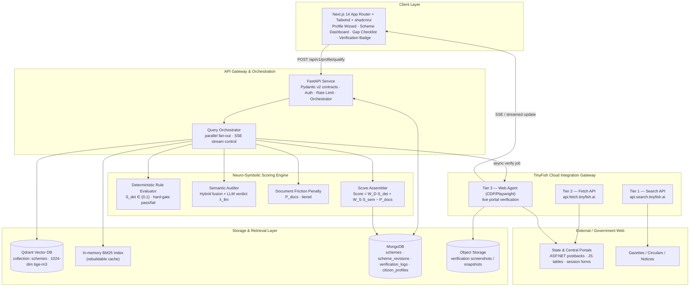
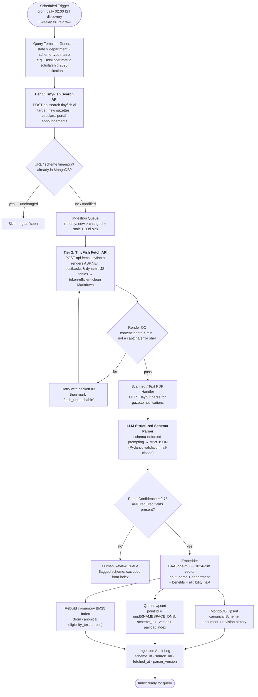
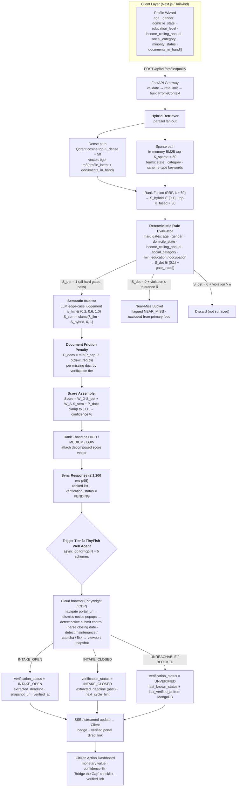
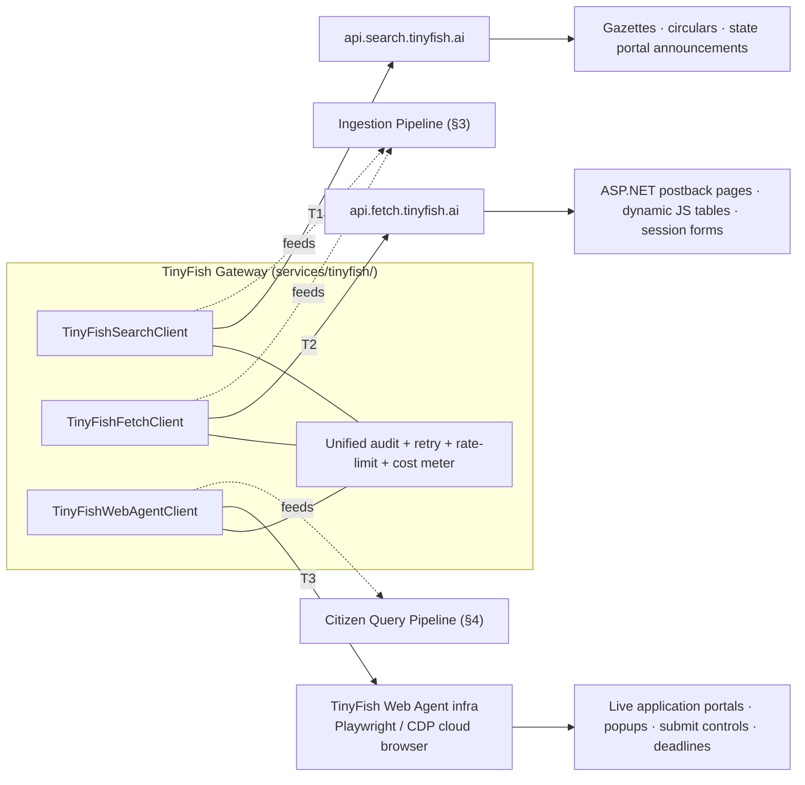

# SchemeRadar — System Architecture & Engine Design

> **Document Status:** Phase 1 of 5 — *Approved Baseline*
> **Version:** 1.0.0
> **Scope:** System flowcharts, module boundaries, neuro-symbolic scoring formulation, and TinyFish 3-tier integration architecture.
> **Out of Scope:** Data schemas (Phase 2), workflows/edge cases (Phase 3), pitch content (Phase 4), build order (Phase 5).
> **Constraint:** This document contains *no application source code*. All formulas, schemas, and diagrams are specifications only.

---

## Table of Contents

1. [System Overview & Design Goals](#1-system-overview--design-goals)
2. [High-Level Architecture](#2-high-level-architecture)
3. [Flowchart A — Ingestion Pipeline](#3-flowchart-a--ingestion-pipeline)
4. [Flowchart B — Citizen Query & Verification Pipeline](#4-flowchart-b--citizen-query--verification-pipeline)
5. [Module Specifications](#5-module-specifications)
6. [Neuro-Symbolic Scoring Engine — Mathematical Formulation](#6-neuro-symbolic-scoring-engine--mathematical-formulation)
7. [TinyFish 3-Tier Integration Architecture](#7-tinyfish-3-tier-integration-architecture)
8. [Cross-Cutting Concerns (Latency, Reliability, Security)](#8-cross-cutting-concerns)
9. [Canonical Constants Registry](#9-canonical-constants-registry)
10. [Glossary of Canonical Entity Names](#10-glossary-of-canonical-entity-names)

---

## 1. System Overview & Design Goals

### 1.1 Problem Restatement

Indian welfare schemes worth ₹1.4 Lakh Crore+ are fragmented across hundreds of unlinked state/central portals that defeat standard crawlers (ASP.NET postbacks, session-locked forms, JS-rendered tables), publish eligibility rules as scanned 40–60 page gazette PDFs in bureaucratic legalese, and decay into ghost links on aggregator blogs. SchemeRadar converts a short citizen profile into a **ranked, live-verified, gap-analyzed** list of schemes the citizen genuinely qualifies for.

### 1.2 Design Goals & Non-Functional Requirements

| # | Goal | Target / Success Criterion |
|---|------|---------------------------|
| G1 | **Correctness of eligibility** | Deterministic gates must never produce a false "eligible" for a hard constraint (income, age, domicile, gender, category). Zero tolerance. |
| G2 | **Freshness of links** | Every `portal_url` surfaced to a citizen must have been live-verified by the TinyFish Web Agent within the last **60 minutes** (`verification_status` + `verified_at` timestamp enforced). |
| G3 | **Interactive latency** | Ranked list (pre-verification) returned at **p95 ≤ 1,200 ms**. Fully verified payload at **p95 ≤ 6,000 ms** via streaming. |
| G4 | **Ingestion coverage** | Discovery crawler discovers newly notified schemes within **≤ 24 h** of publication; full refresh cycle ≤ 7 days. |
| G5 | **Explainability** | Every score must decompose into its three terms (`W_D·S_det`, `W_S·S_sem`, `P_docs`) and list each failed gate and each missing document. |
| G6 | **Multilingual readiness** | Embedding model must support Indian languages (future voice/regional scope). |
| G7 | **Graceful degradation** | All TinyFish tiers must have defined fallbacks so a portal outage never blocks the core eligibility answer. |

### 1.3 Architectural Style

A **layered, event-assisted microservice-lite architecture**:

- **Synchronous path** for citizen queries (FastAPI orchestrator, parallel fan-out to retrieval + rules + LLM).
- **Asynchronous path** for (a) scheduled ingestion/discovery, and (b) on-demand portal verification (fire-and-forget job with SSE/streamed result update).
- **Single source of truth:** MongoDB holds the canonical `Scheme` record; Qdrant holds only the derived vector + payload index for search; the in-memory BM25 index is a rebuildable cache derived from the same canonical record.

**Dependency rule:** Dependencies point strictly downward. `Client → API Gateway → {Retrieval, Scoring, TinyFish Gateway} → Storage`. The Scoring Engine never calls the Client; the Storage layer never calls TinyFish; the TinyFish Gateway never reads Qdrant directly.

---

## 2. High-Level Architecture



---

## 3. Flowchart A — Ingestion Pipeline

**Purpose:** Continuously discover, render, parse, embed, and index government welfare schemes so the canonical store never contains a stale or ghost scheme.



### 3.1 Ingestion Stage Contracts

| Stage | Input | Output | Failure Mode & Fallback |
|-------|-------|--------|-------------------------|
| Query Template Generator | State/UT list, department list, scheme-type taxonomy, current fiscal/academic year | Ordered query string list | Static seed list if template engine fails |
| **Tier 1 — TinyFish Search** | Query string + recency window | Result set: `url`, `title`, `snippet`, `published_at` | Fall back to RSS/sitemap polling of known portals; mark discovery as degraded |
| Dedup | `url` + content hash | Queue decision | Content hash compare against `scheme_revisions` |
| **Tier 2 — TinyFish Fetch** | `portal_url` / `notice_url` | Clean Markdown of rendered DOM | 3 retries → `fetch_unreachable` status; scheme never enters index with unverified content |
| PDF Handler | PDF bytes / scanned image | Markdown text | OCR fallback; if OCR confidence low → Human Review Queue |
| LLM Structured Schema Parser | Markdown + gazette text | Strict JSON conforming to the Scheme Data Model | Fail-closed: any schema violation → Human Review Queue, never partial-write to Qdrant |
| Embedder | Canonical text block | 1024-dim vector | Retry ×3; on failure, upsert blocked (search must not miss the scheme silently) |
| Storage Upsert | Vector + canonical doc | `scheme_id` in Qdrant + MongoDB | Transactional ordering: MongoDB commit first, Qdrant second; Qdrant failure → requeue |

**Idempotency:** every ingestion record is keyed by `scheme_id` + `content_hash`. Re-running a cycle must never create duplicate Qdrant points.

---

## 4. Flowchart B — Citizen Query & Verification Pipeline

**Purpose:** Turn a citizen profile into a ranked, scored, live-verified scheme list within the latency budget of §8.



### 4.1 Query Path Stage Contracts

| Stage | Input | Output | Budget |
|-------|-------|--------|--------|
| Gateway validation | Raw HTTP body | `ProfileContext` | ≤ 20 ms |
| Dense retrieval | Profile intent vector | top-50 `(scheme_id, score)` | ≤ 120 ms |
| Sparse retrieval | Profile keyword bag | top-50 `(scheme_id, bm25_score)` | ≤ 40 ms |
| Rank fusion | Two ranked lists | top-30 fused + `S_hybrid` | ≤ 10 ms |
| Deterministic evaluation | Profile + `Scheme` gates | `S_det`, `gate_trace[]`, `near_miss` flag | ≤ 50 ms for 30 candidates |
| LLM semantic audit | Top-10 candidate snippets + profile | `λ_llm` per candidate | ≤ 900 ms (batched) |
| Penalty + assembly | Gates, `S_sem`, `required_documents[]` | Final `Score`, band, checklist | ≤ 20 ms |
| **Tier 3 verification** | `portal_url` | `verification_status`, `extracted_deadline`, `snapshot_url` | ≤ 6,000 ms per portal (async) |

---

## 5. Module Specifications

### 5.1 Client Layer — `web/` (Next.js / Tailwind)

| Attribute | Specification |
|-----------|---------------|
| **Responsibility** | Presentation and input collection only. Renders the profile wizard, the ranked scheme dashboard, the gap checklist, and the live verification badge. |
| **Owns** | UI state, routing, form validation, i18n strings, display formatting (₹ currency, date locale), SSE client for streamed verification updates. |
| **Must NOT own** | Any eligibility math, score computation, penalty logic, or link-verification claims. The client displays *only* server-computed `Score`, `S_det`, `S_sem`, `P_docs`, and `verification_status`. |
| **Inputs** | Citizen form input; API responses (`SchemeMatch[]`, `VerificationEvent`). |
| **Outputs** | `POST /api/v1/profile/qualify`, `POST /api/v1/verify/{scheme_id}`, `GET /api/v1/checklist/{scheme_id}`. |
| **Failure behavior** | If SSE drops, show last-known `verification_status` with its `verified_at` age; never fabricate a "Verified" badge. |

### 5.2 API Gateway & Orchestration — `services/api/` (FastAPI)

| Attribute | Specification |
|-----------|---------------|
| **Responsibility** | Single public entry point. Contract enforcement (Pydantic v2), authentication, rate limiting, and the **Query Orchestrator** that fans out to retrieval, scoring, and verification in the correct order with timeouts. |
| **Owns** | Route definitions, request/response schemas, orchestrator control flow, per-request tracing id, latency budget enforcement, SSE stream lifecycle, admin/inestion trigger endpoints. |
| **Must NOT own** | Vector math, rule evaluation logic, LLM prompting, browser automation — these are delegated to their modules behind typed interfaces. |
| **Inputs** | HTTP/JSON from Client — a `ProfileContext` body plus the optional `?q=` query string on `POST /api/v1/profile/qualify` (§5.2.1); internal calls to Retrieval, Scoring, TinyFish Gateway; reads/writes to MongoDB. |
| **Outputs** | Sync response — `QualificationResponse` whose `matches[]` is `SchemeMatch[]` + `score_breakdown` (§5.2.1); async `VerificationEvent` streams; audit logs. |
| **Key endpoints** | `POST /api/v1/profile/qualify` (body `ProfileContext`, query `?q=` — §5.2.1) · `GET /api/v1/schemes/{scheme_id}` · `POST /api/v1/verify/{scheme_id}` · `GET /api/v1/checklist/{scheme_id}` · `GET /api/v1/verify/stream/{job_id}` (SSE) · `POST /api/v1/admin/ingest/refresh` (protected) |
| **Failure behavior** | Downstream timeout → return partial results with `verification_status = PENDING` rather than a 5xx. Never block the eligibility answer on TinyFish. |

#### 5.2.1 Dual-Path Discovery / Search Flow — `POST /api/v1/profile/qualify`

**One route, two modes.** The endpoint always takes a `ProfileContext` body. A single optional query parameter, `?q=`, selects between two paths; there is no second search endpoint, and the body schema (DATA_SPEC §3.1) is byte-identical in both modes.

| | **Mode 1 — Home Screen Discovery** | **Mode 2 — Keyword Search** |
|---|---|---|
| **Trigger** | `q` absent, empty, or whitespace-only | `q` present and non-empty |
| **Search string** | **Synthesized from the profile** — state, education, category (e.g. `DL bachelor 1st year SC`) | The raw query text `q` exactly as the citizen typed it |
| **Retrieval** | Hybrid Retrieval (Qdrant dense + BM25 sparse, RRF-fused) runs over the **synthesized** string | Hybrid Retrieval runs over the **raw `q`** text |
| **Scoring** | Scorer filters the retrieved candidates through the hard gates against `ProfileContext` | Scorer **intercepts** the retrieved candidates and evaluates/filters them against `ProfileContext` |
| **UI** | `QualificationResponse` → ranked list, nothing typed | `QualificationResponse` → ranked list reflecting the typed query |

**Pipeline (identical order in both modes):**

| # | Stage | Contract |
|---|---|---|
| 1 | **Resolve the search string** | `q` if `q` else `synthesize_profile_query(profile)`. This is the *only* line where the two modes differ. |
| 2 | **Hybrid Retrieval** | Qdrant dense (`K_dense = 50`, 1024-d `BAAI/bge-m3`) + in-memory BM25 sparse (`K_sparse = 50`) → RRF `k = 60` → fused `K_fused = 30` candidates; payload filters applied **after** fusion (BUILD_ORDER 4.4). This stage only *proposes* candidates — it makes no eligibility decision. |
| 3 | **Deterministic Scoring** | The 7 hard gates run against `ProfileContext` → `S_det ∈ {0,1}` + `gate_trace[]`; the Score Assembler applies `Score = 0.60·S_det + 0.40·S_sem − P_docs` and assigns a band (§6, BUILD_ORDER 4.1 / 4.7). |
| 4 | **Frontend display** | The client renders `QualificationResponse.matches` — `Score`, band, `score_breakdown`, `verification_status`. Per §5.1 "Must NOT own": **the browser computes nothing.** |

**Response envelope — `QualificationResponse`** (defined in `services/api/routes/qualify.py`):

| Field | Type | Meaning |
|---|---|---|
| `mode` | `"discovery"` \| `"search"` | Which path ran — Mode 1 or Mode 2. |
| `query` | `string` | The resolved search string: `q` verbatim in Mode 2, the synthesized string in Mode 1. Echoed so the UI can show *what* was searched. |
| `matches` | `SchemeMatch[]` (DATA_SPEC §3.2) | Ranked results, each carrying `score_breakdown`. |
| `count` | integer | `len(matches)`. |

**Invariants:**

- The mode is decided by `q` **alone** — never by the contents of the profile.
- Retrieval always runs **before** scoring: scoring needs a candidate set, and retrieval never gates anything on its own.
- `q` steers **retrieval only**. It can never loosen a hard gate — `S_det` is a pure function of `(ProfileContext, Scheme.gates)` (§5.4), so a keyword hit cannot promote an ineligible profile past a failed gate, and a near-miss stays a routing concern, not a scoring one (§6.2.2).
- Scoring is identical in both modes; only the search string differs.

### 5.3 Storage & Retrieval Layer

#### 5.3.1 Qdrant Vector DB

| Attribute | Specification |
|-----------|---------------|
| **Responsibility** | Dense semantic recall over the scheme corpus. |
| **Collection** | `schemes` |
| **Point ID** | `uuid5(NAMESPACE_DNS, scheme_id)` — a deterministic UUID. Qdrant accepts only an unsigned integer or a UUID, never a string, so the string `scheme_id` cannot be the storage key. `scheme_id` stays the globally unique logical identifier (deterministic from slug + fiscal year) and travels in the payload as the **primary join key** back to MongoDB. |
| **Vector** | 1024-dim, `BAAI/bge-m3`, cosine distance |
| **Embedded text** | `name + " " + department + " " + benefits_text + " " + eligibility_text` |
| **Payload (indexable)** | `domicile_state`, `category`, `scheme_type`, `department`, `fiscal_year`, `is_active`, `verification_status` |
| **Payload (stored)** | `scheme_id` (join key), `name`, `income_ceiling_annual`, `min_age`, `max_age`, `benefits_summary` |
| **Owns** | ANN search, payload filtering, point upsert/delete. |
| **Must NOT own** | Canonical document truth (MongoDB), BM25 scoring, any rule evaluation. |

#### 5.3.2 In-Memory BM25 Index

| Attribute | Specification |
|-----------|---------------|
| **Responsibility** | Sparse lexical recall for hard legal tokens ("OBC", "SC/ST", "Delhi domicile", "post-matric", "PM-Kisan") that dense embeddings blur. |
| **Corpus** | `name + department + benefits + eligibility_text` from the canonical MongoDB record. |
| **Characteristics** | Rebuildable cache — never authoritative. Rebuilt on ingestion upsert and on cold start. Lives in the API process (or a dedicated retrieval sidecar) with a version stamp. |
| **Owns** | Tokenization (case-folded, Hindi-aware, stopwords), IDF/BM25 scoring (k1 = 1.2, b = 0.75), top-K sparse ranking. |
| **Must NOT own** | Persistence, filtering by structured fields (filters are applied *after* fusion by the orchestrator). |

#### 5.3.3 MongoDB

| Attribute | Specification |
|-----------|---------------|
| **Responsibility** | Canonical source of truth + operational records. |
| **Collections** | `schemes` (canonical Scheme document), `scheme_revisions` (version history + content hashes), `verification_logs` (every Web Agent run), `citizen_profiles` (opt-in), `ingestion_audit` |
| **Owns** | Document truth, revision history, verification history (enforcing the 60-minute freshness rule via `verified_at`), human-review queue. |
| **Must NOT own** | Vector similarity computation. |

#### 5.3.4 Object Storage

| Attribute | Specification |
|-----------|---------------|
| **Responsibility** | Immutable evidence: Web Agent viewport snapshots proving a link was checked. |
| **Keying** | `snapshots/{scheme_id}/{job_id}.png` with lifecycle expiry at 90 days. |
| **Owns** | Byte storage, signed URL issuance. |

### 5.4 Neuro-Symbolic Scoring Engine — `services/scoring/`

| Sub-module | Responsibility | Inputs | Outputs |
|------------|----------------|--------|---------|
| **Deterministic Rule Evaluator** | Evaluate structured gates as a boolean expression tree over the profile and the scheme's gate fields. Pure, side-effect-free, fully auditable. | `ProfileContext`, `Scheme.gates` | `S_det ∈ {0,1}`, `gate_trace[]` (per-gate pass/fail + observed vs required), `near_miss` flag |
| **Semantic Auditor** | Judge soft/qualitative conditions (course accreditation, family-size caveats, "discontinued student" clauses) and emit a coarse verdict multiplier. | Top-K candidate snippets + profile | `λ_llm ∈ {0.2, 0.6, 1.0}`, `semantic_notes[]` |
| **Document Friction Penaltizer** | Diff `required_documents[]` against `documents_in_hand[]` and accumulate the tiered penalty. | `Scheme.required_documents[]`, `ProfileContext.documents_in_hand[]` | `P_docs ∈ [0, P_cap]`, `missing_documents[]` with per-document `p(d)` |
| **Score Assembler** | Combine the three terms, clamp, band, and produce the explainable breakdown. | `S_det`, `S_hybrid`, `λ_llm`, `P_docs` | `Score ∈ [0,1]`, `band`, `score_breakdown` |

**Determinism guarantees:**
- The Rule Evaluator is a pure function of `(ProfileContext, Scheme.gates)` — same inputs always yield the same `S_det` and identical `gate_trace`.
- The LLM is invoked **only** for `λ_llm` and `semantic_notes` — it can *down-weight* but can **never** promote a scheme past a failed hard gate (`S_det = 0` ⇒ scheme is not in the primary feed regardless of `λ_llm`).
- Every response carries `score_breakdown` so G5 (explainability) is testable.

### 5.5 TinyFish Cloud Integration Gateway — `services/tinyfish/`

A single internal façade exposing exactly three typed clients (details in §7):

| Client | Method surface | Owner of |
|--------|----------------|----------|
| `TinyFishSearchClient` | `discover(queries, recency_window) → SearchHit[]` | Discovery crawler queries only |
| `TinyFishFetchClient` | `render(url, timeout) → FetchResult{markdown, final_url, status}` | Dynamic DOM rendering for ingestion only |
| `TinyFishWebAgentClient` | `verify(url, scheme_id) → VerificationResult{status, deadline, snapshot_url}` | Live per-query portal verification only |

**Boundary rule:** No other module may call TinyFish endpoints directly. This centralizes retries, rate limits, cost accounting, and audit logging in one place.

---

## 6. Neuro-Symbolic Scoring Engine — Mathematical Formulation

### 6.1 Master Formula

For a citizen profile $P$ and a candidate scheme $S$, the final eligibility score is:

$$\boxed{\;Score(P, S) \;=\; \mathrm{clamp}\Big(\;W_D \cdot S_{det} \;+\; W_S \cdot S_{sem} \;-\; P_{docs}\;,\; 0,\; 1\;\Big)\;}$$

with constraint $W_D + W_S = 1$.

**Default weights (Canonical Constants Registry, §9):**

| Symbol | Value | Rationale |
|--------|-------|-----------|
| $W_D$ | **0.60** | Hard eligibility gates dominate: a scheme that fails a rule must never rank above one that satisfies it. |
| $W_S$ | **0.40** | Retrieval relevance and LLM nuance rank *within* the eligible set, they do not override it. |

**Decomposition stored per match** (for `score_breakdown`, G5):

```
term_deterministic = W_D * S_det            ∈ {0.00, 0.60}
term_semantic      = W_S * S_sem            ∈ [0, 0.40]
term_penalty       = -P_docs                ∈ [-0.60, 0.00]
Score              = clamp(sum of above, 0, 1)
```

**Score bands (confidence displayed to the citizen):**

| Band | Score | UI treatment |
|------|-------|--------------|
| `HIGH` | $Score \ge 0.80$ | Primary feed, "95% Match" style badge |
| `MEDIUM` | $0.60 \le Score < 0.80$ | Primary feed, subdued badge |
| `LOW` | $0.30 \le Score < 0.60$ | Collapsed "Also consider" section |
| Suppressed | $Score < 0.30$ | Not surfaced in primary feed |
| `NEAR_MISS` | $S_{det}=0$ but violation ≤ tolerance $\delta$ | Separate bordered section: "Borderline — verify before applying" |

---

### 6.2 Term 1 — Deterministic Pass $S_{det} \in \{0, 1\}$

Let $G_{hard} = \{g_{age},\; g_{gender},\; g_{domicile},\; g_{income},\; g_{category},\; g_{education},\; g_{occupation}\}$ be the set of **hard gates**. Each gate $g_i$ evaluates to $\text{true}$ or $\text{false}$ against the profile. Then:

$$S_{det}(P,S) \;=\; \prod_{g_i \,\in\, G_{hard}} \mathbb{1}\big[g_i(P, S) = \text{true}\big] \;\in\; \{0, 1\}$$

where $\mathbb{1}[\cdot]$ is the indicator function and $\prod$ over booleans is logical AND. **All hard gates must pass**; a single failure forces $S_{det} = 0$.

#### 6.2.1 Gate Boundary Conditions (exact, side-effect-free)

| Gate | Predicate | Boundary semantics (inclusive/exclusive) |
|------|-----------|------------------------------------------|
| $g_{age}$ | $S.\texttt{min\_age} \le P.\texttt{age} \le S.\texttt{max\_age}$ | **Inclusive** both ends. Missing `min_age` → treat as $-\infty$; missing `max_age` → $+\infty$. |
| $g_{gender}$ | $P.\texttt{gender} \in S.\texttt{gender}$ | `gender` is a set; `["ALL"]` means unrestricted. |
| $g_{domicile}$ | $P.\texttt{domicile\_state} \in S.\texttt{domicile\_state}$ | `domicile_state` is a set of state/UT codes; `["ALL"]` means pan-India. |
| $g_{income}$ | $P.\texttt{annual\_household\_income} \le S.\texttt{income\_ceiling\_annual}$ | **Inclusive**: exactly equal to the ceiling **passes**. Missing/null ceiling → gate passes (treat as unrestricted) but flag `assumed_unrestricted = true`. Negative income → validation error at gateway. |
| $g_{category}$ | $P.\texttt{social\_category} \in S.\texttt{allowed\_categories}$ | Includes EWS/Minority overlays: if `S.requires_minority_flag`, then $P.\texttt{minority\_status} = \text{true}$ is ANDed into this gate. |
| $g_{education}$ | $P.\texttt{education\_level} \succeq S.\texttt{min\_education\_level}$ | Ordered lattice: `below_10 < 10th < 12th < diploma < bachelor_1st_year < bachelor < post_grad < phd`. |
| $g_{occupation}$ | $P.\texttt{occupation} \in S.\texttt{allowed\_occupations}$ (if defined) | e.g. `farmer` for PM-Kisan. Absent → passes. |

#### 6.2.2 Near-Miss Tolerance Band $\delta$ (strict scoring, graceful surfacing)

When $S_{det} = 0$, the evaluator computes the **normalized violation distance** and routes rather than silently discards:

$$\Delta(P,S) \;=\; \max_{g_i \,\in\, G_{hard},\; g_i = \text{false}} \delta_{g_i}(P,S)$$

| Failed gate | $\delta_{g_i}$ definition | Tolerance threshold |
|-------------|---------------------------|---------------------|
| $g_{income}$ | $\dfrac{P.\texttt{income} - S.\texttt{ceiling}}{\max(S.\texttt{ceiling},\;1)}$ | $\delta_{income} = 0.05$ (within 5% of ceiling ⇒ **near-miss**) |
| $g_{age}$ | $\dfrac{\text{days outside range}}{365}$ | $\delta_{age} \le 1.0$ (within 1 year ⇒ **near-miss**) |
| All other gates | $0$ or $1$ (categorical) | No tolerance ⇒ hard fail |

- If $\Delta \le \delta_{gate}$: route to **NEAR_MISS bucket** — still shown, *but with `S_det = 0` unchanged*, so the score remains low and the UI must display the specific violation ("Family income ₹2,55,000 exceeds the ₹2,50,000 ceiling by ₹5,000"). This satisfies Edge Case #2 of Phase 3 without weakening correctness.
- If $\Delta > \delta_{gate}$: **discard** from results entirely.

> **Invariant:** the near-miss bucket can never inflate $S_{det}$. Near-miss is a *routing* concern, not a *scoring* concern.

---

### 6.3 Term 2 — Semantic Score $S_{sem} \in [0, 1]$

$S_{sem}$ is the product of hybrid retrieval relevance and an LLM verdict multiplier:

$$\boxed{\;S_{sem} \;=\; \mathrm{clamp}\big(\lambda_{llm} \cdot S_{hybrid},\; 0,\; 1\big)\;}$$

#### 6.3.1 Hybrid Retrieval Fusion — $S_{hybrid}$

Two ranked lists over the same top-$K$ candidate set:

- $r_d(s)$ = rank of scheme $s$ in the **dense** (Qdrant cosine) list, top-$K_{dense} = 50$
- $r_b(s)$ = rank of scheme $s$ in the **sparse** (BM25) list, top-$K_{sparse} = 50$

**Primary fusion method — Reciprocal Rank Fusion (RRF), $k = 60$:**

$$\mathrm{RRF}(s) \;=\; \frac{1}{k + r_d(s)} \;+\; \frac{1}{k + r_b(s)}, \qquad k = 60$$

Normalized to $[0,1]$ against the theoretical maximum (rank 1 in both lists):

$$S_{hybrid}^{RRF}(s) \;=\; \frac{\mathrm{RRF}(s)}{\mathrm{RRF}_{\max}} \;=\; \frac{\mathrm{RRF}(s)}{\dfrac{2}{k+1}} \;=\; \frac{(k+1)\,\mathrm{RRF}(s)}{2}$$

A scheme present in only one list contributes only its own term (the missing rank term is $0$, not $1/k$), so single-source recall is scored honestly. Top-$K_{fused} = 30$ candidates proceed to rule evaluation.

**Configurable alternative — Linear Interpolation (switch `fusion_mode`):**

$$S_{hybrid}^{lin}(s) \;=\; \alpha \cdot \hat{d}(s) \;+\; (1-\alpha)\cdot \hat{b}(s), \qquad \alpha = 0.60$$

where $\hat{d}(s)$ is min-max-normalized cosine similarity over the dense top-K and $\hat{b}(s)$ is min-max-normalized BM25 over the sparse top-K. **Dense weighting $\alpha = 0.60$** reflects intent ("engineering college fee support") dominating exact tokens, while still reserving 40% for hard legal tokens ("OBC", "Delhi"). RRF is the **default** in production because it is rank-based and robust to score-distribution drift between the two scorers.

#### 6.3.2 LLM Semantic Verdict Multiplier — $\lambda_{llm}$

The Semantic Auditor evaluates soft, non-arithmetic clauses that cannot be expressed as boolean gates (course accreditation status, "discontinued student" exclusions, family-size caveats, employment-status nuance, matching against the *actual* academic year).

| Verdict | $\lambda_{llm}$ | Meaning |
|---------|-----------------|---------|
| `MATCH` | **1.0** | All soft clauses satisfied; no contradiction found. |
| `PARTIAL` | **0.6** | Ambiguous / partially satisfied (e.g., accreditation unconfirmed, clause interpretation unclear). |
| `NO_MATCH` | **0.2** | A soft clause explicitly excludes this citizen (e.g., "already availed similar assistance"). |

**Hard constraint on the LLM:** $\lambda_{llm}$ can only *reduce* $S_{sem}$. It cannot change $S_{det}$, cannot un-fail a gate, and cannot add a scheme to the feed. If the LLM times out or errors, $\lambda_{llm} \mathrel{:=} 1.0$ with `semantic_notes = ["auditor_unavailable"]` — the system degrades to pure retrieval + deterministic rules rather than failing the request.

---

### 6.4 Term 3 — Document Friction Penalty $P_{docs}$

Captures *how far the citizen is from being able to actually apply*, not whether they are eligible.

$$\boxed{\;P_{docs} \;=\; \min\Big(P_{cap},\;\; \sum_{d \,\in\, M} p(d) \cdot w_{req}(d)\Big), \qquad P_{cap} = 0.60\;}$$

where $M$ = set of documents in `Scheme.required_documents[]` **not present** in `ProfileContext.documents_in_hand[]`.

#### 6.4.1 Verification Tiers & Penalty Values $p(d)$

| Tier | Document friction class | Representative documents | $p(d)$ per document |
|------|-------------------------|--------------------------|---------------------|
| **Tier 0** | Already in hand, or pure self-assertion | Documents already listed in `documents_in_hand`; self-declaration form; applicant photograph; declaration/undertaking affidavit | **0.00** |
| **Tier 1** | Low friction — self-service / instant | Aadhaar (if missing), bank passbook / DBT-seeded account proof, prior marksheet/transcript, admission letter, fee receipt, bonafide certificate | **0.05** |
| **Tier 2** | Medium friction — single local-office issuance | Domicile / Residence certificate, Caste (SC/ST/OBC) certificate, Non-Creamy Layer certificate (central), Ration Card, disability certificate | **0.10 – 0.15** |
| **Tier 3** | High friction — Tehsildar / SDM / e-District attested | **Income Certificate (SDM/Tehsildar/e-District attested)** — canonical high-friction case, Family Income Certificate on prescribed form, EWS certificate | **0.15 – 0.25** |
| **Tier 4** | Very high friction — long lead time / third-party verification | Land record (ROR/khasra), property documents, course AICTE/AIU accreditation proof, employer NOC, physically attested document sets requiring in-person visit | **0.25 – 0.35** |

*(Full canonical enumeration with exact per-document values lives in Phase 2 `docs/DATA_SPEC.md`.)*

#### 6.4.2 Requirement Weight $w_{req}(d)$

| Case | $w_{req}(d)$ | Rationale |
|------|--------------|-----------|
| Mandatory document (no alternative accepted) | **1.0** | Full friction applies. |
| Optional / one-of-alternatives satisfied | **0.0** | Not summed at all (document not in $M$). |
| Alternative *partially* satisfiable (e.g., self-declared affidavit accepted for provisional application but certificate required for final sanction) | **0.5** | Half weight: citizen can start, but final disbursement is at risk. |

#### 6.4.3 Penalty Clamps & Properties

- $P_{docs} \in [0,\, 0.60]$ via $P_{cap} = 0.60$. Even a maximally burdened citizen never goes below $Score = 0$ after clamping, and never loses a scheme entirely for paperwork alone.
- **Maximum penalty does not cancel eligibility:** with $S_{det}=1$, $S_{sem}=1$, worst case $Score = 0.60 + 0.40 - 0.60 = 0.40$ → `LOW` band, still surfaced with a checklist.
- **Minimum:** citizen holds everything → $P_{docs} = 0$, and the scheme reaches its true ceiling.
- $P_{docs}$ **never negative** (no bonus for holding extra documents).

**Worked example (consistent across all phases):**

| Input | Value |
|-------|-------|
| Profile income | ₹2,55,000 vs ceiling ₹2,50,000 ⇒ $g_{income}$ false but $\Delta = 0.02 \le 0.05$ ⇒ **NEAR_MISS** (primary-feed $S_{det}$ remains **0**) |
| Eligible-citizen example: age, gender, domicile, category, education all pass | $S_{det} = 1$ |
| Hybrid retrieval rank 3 in both lists, RRF | $S_{hybrid} = \frac{(61)(\frac{1}{63}+\frac{1}{63})}{2} \approx 0.968$ |
| LLM verdict `MATCH` | $\lambda_{llm} = 1.0 \Rightarrow S_{sem} \approx 0.968$ |
| Missing: SDM Income Certificate (Tier 3, $p=0.20$, mandatory $w=1.0$) + Bank passbook (Tier 1, $p=0.05$) | $P_{docs} = 0.25$ |
| **Score** | $0.60(1) + 0.40(0.968) - 0.25 = 0.60 + 0.387 - 0.25 = \mathbf{0.737}$ → **`MEDIUM` (74% match)** with checklist item: *"Obtain SDM-attested Income Certificate via e-District"* |

---

### 6.5 Engine Pseudocode (Specification Only — Not Source Code)

```
FUNCTION EvaluateScore(profile P, scheme S, hybrid_rank_score H, llm_verdict L):

    # --- Term 1: deterministic ---
    gate_trace ← EMPTY LIST
    all_pass ← TRUE
    FOR EACH gate g IN S.hard_gates:
        result ← EvaluateGate(g, P)
        APPEND {gate: g.name, pass: result.pass,
                observed: result.observed, required: result.required} TO gate_trace
        IF result.pass = FALSE:
            all_pass ← FALSE
            delta ← NormalizeViolation(result)
    S_det ← 1 IF all_pass ELSE 0

    # --- routing (does NOT alter S_det) ---
    IF S_det = 0:
        route ← "DISCARD" IF delta > Tolerance[g] ELSE "NEAR_MISS"
        RETURN {score: 0, S_det: 0, route: route, gate_trace: gate_trace}

    # --- Term 2: semantic ---
    lambda ← 1.0 IF L unavailable ELSE MapVerdictToLambda(L)   # {1.0, 0.6, 0.2}
    S_sem ← CLAMP(lambda * H, 0, 1)

    # --- Term 3: documents ---
    missing ← S.required_documents  MINUS  P.documents_in_hand
    P_docs ← MIN(P_cap, SUM(p(d) * w_req(d) FOR d IN missing))

    # --- assembly ---
    raw ← (W_D * S_det) + (W_S * S_sem) - P_docs
    Score ← CLAMP(raw, 0, 1)
    band  ← BandFor(Score)

    RETURN {score: Score, band: band, S_det: S_det, S_sem: S_sem,
            P_docs: P_docs, gate_trace: gate_trace,
            missing_documents: missing, lambda: lambda}
```

---

## 7. TinyFish 3-Tier Integration Architecture

All three tiers are accessed **only** through the TinyFish Gateway façade (§5.5). Each tier has a distinct purpose, target web pattern, invocation contract, and latency budget.



### 7.1 Tier 1 — TinyFish Search API (Discovery)

| Attribute | Specification |
|-----------|---------------|
| **Endpoint** | `https://api.search.tinyfish.ai` |
| **Purpose** | *Find* newly notified government welfare circulars, gazettes, and state portal announcements that the platform has never seen. Feeds the **Ingestion Pipeline only** — never the citizen query path. |
| **When invoked** | Scheduled: daily discovery cron (02:00 IST) + on-demand `POST /api/v1/admin/ingest/refresh`. |
| **Invocation contract** | `discover(query_templates[], recency_window, max_results) → SearchHit[]`, where each `SearchHit` = `{url, title, snippet, published_at}`. |
| **Query templates** | Combinatorial matrix: `{state/UT} × {department} × {scheme_type} × {fiscal_year}` + intent suffixes (`"2026 notification"`, `"revised income ceiling"`, `"application last date"`, `"amendment gazette"`). Example: `"Delhi post matric scholarship SC ST OBC 2026 notification last date"`. |
| **Target web patterns** | Indian government domains (`.gov.in`, `.nic.in`, state portals), DGIPR/department press releases, e-Gazette India, state labor welfare board notices — sources where *standard search engines index poorly or late*. |
| **Post-processing** | Dedupe against `schemes`/`scheme_revisions` by URL + content hash; route new/changed hits to the ingestion queue. |
| **Latency budget** | **≤ 2,000 ms per query batch** (async, off the request path). Failure → retry ×3 with exponential backoff, then degrade to sitemap/RSS polling. |
| **Cost control** | Query templates deduplicated per cycle; budget cap of N queries/day logged in the unified audit. |

### 7.2 Tier 2 — TinyFish Fetch API (Dynamic Rendering for Ingestion)

| Attribute | Specification |
|-----------|---------------|
| **Endpoint** | `https://api.fetch.tinyfish.ai` |
| **Purpose** | Render JavaScript-heavy, stateful government pages that `requests` + `BeautifulSoup` cannot handle, and return **token-efficient clean Markdown** of the live DOM so the LLM parser receives structured eligibility tables instead of raw HTML noise. |
| **When invoked** | Ingestion Pipeline only, after a Search hit (or scheduled re-crawl) is queued. |
| **Invocation contract** | `render(url, timeout_ms, wait_for) → FetchResult{markdown, final_url, http_status, rendered_at, content_hash}`. |
| **Target web patterns** | **Legacy ASP.NET `__doPostBack` pages** with view-state payloads; **dynamic JS tables** populated via XHR after load; multi-step session-locked forms; accordion/tabbed eligibility sections that are empty in raw HTML; iframe-embedded notice boards. |
| **Render directives** | Wait for network idle + explicit selector for the eligibility/notice container; strip navigation/ads/boilerplate; preserve table structure as Markdown tables (critical: income ceilings and date ranges live in tables). |
| **Latency budget** | **≤ 8,000 ms per page** (async, off the request path). Retry ×3 backoff; terminal failure ⇒ `fetch_unreachable`, scheme does **not** enter the index with unrendered content (never parse raw HTML as if it were rendered). |
| **PDF sidecar** | Where the eligibility rule lives only in a scanned gazette PDF, Fetch returns the PDF URL; an OCR handler converts it to text before the LLM parser. |
| **Output quality gate** | Minimum content length + not a captcha/error shell + not a "site under maintenance" page (checked *before* LLM spend). |

### 7.3 Tier 3 — TinyFish Web Agent / Browser Infrastructure (Live Verification)

| Attribute | Specification |
|-----------|---------------|
| **Endpoint** | TinyFish Web Agent / Browser Infrastructure (Playwright/CDP-driven cloud browser) |
| **Purpose** | **Per-citizen-query live verification.** Before any scheme is shown as actionable, an autonomous agent drives a real cloud browser to the `portal_url` to prove the intake window is *actually open right now*, extract the true deadline, and capture a viewport snapshot as evidence. This is what defeats **ghost & expired links**. |
| **When invoked** | Async job triggered by the orchestrator for **top-N = 5** ranked schemes after the sync response is returned; results stream back over SSE. Also invoked by the re-verification cron that keeps every `verification_status` fresher than 60 minutes. |
| **Invocation contract** | `verify(scheme_id, portal_url, timeout_ms) → VerificationResult{verification_status, extracted_deadline, snapshot_url, final_url, verified_at, observed_signals[]}`. |
| **Target web patterns** | State application portals (Delhi e-District, Haryana Antyodaya-SARAL, National Scholarship Portal, state labor welfare boards) with: static **notice popups / modals** that must be dismissed; `__doPostBack` submit buttons that only enable when intake is open; date strings in mixed formats (`31-03-2026`, `31/03/2026`, `"Last date: 31st March 2026"`); session-locked forms; Cloudflare/WAF challenges; captcha-gated steps; maintenance/5xx outages. |
| **Verification algorithm (summary)** | See Phase 3 `docs/WORKFLOW_AND_TESTS.md` for the full step-by-step agent algorithm. Core steps: (1) navigate, (2) dismiss popups, (3) detect an *enabled* submit/apply control, (4) parse closing-date strings & normalize to ISO-8601, (5) classify outage/captcha/blocked, (6) viewport snapshot, (7) emit status. |
| **Emitted statuses** | `INTAKE_OPEN` · `INTAKE_CLOSED` · `UNREACHABLE` · `BLOCKED` (captcha/WAF) · `PENDING` (not yet run) → normalized to `verification_status` with `UNVERIFIED` fallback. |
| **Latency budget** | **≤ 6,000 ms per portal** (hard timeout), async, off the critical path. Top-5 verified in parallel with a concurrency cap of 3 browsers. The per-portal timeout is a *browser-pool* guard (never let one portal hog a concurrency slot); the *citizen-facing* bound is the §8.1 verified-payload deadline, which truncates the stream with a `PENDING` badge instead of waiting. |
| **Fallback ladder** | (a) Timeout/failure → serve `verification_status = UNVERIFIED` with `last_known_status` + `last_verified_at` from `verification_logs`; (b) never block or fail the sync eligibility response; (c) never display a "Verified" badge without a `verified_at` inside the 60-minute freshness window (G2). |
| **Evidence** | Viewport snapshot written to Object Storage at `snapshots/{scheme_id}/{job_id}.png`. What is stored — `verification_logs.snapshot_key` and `Scheme.snapshot_url` — is a **durable object reference that never expires**; it is never a credential. Reads are served with a presigned `GET` (SigV4 query auth, 1 h) minted at response time, and a bucket lifecycle rule expires the `snapshots/` prefix after **90 days**. |

### 7.4 Tier Summary Matrix

| | Tier 1 — Search | Tier 2 — Fetch | Tier 3 — Web Agent |
|---|---|---|---|
| **Endpoint / Infra** | `api.search.tinyfish.ai` | `api.fetch.tinyfish.ai` | Cloud browser via Playwright/CDP |
| **Primary purpose** | *Discover* unknown schemes | *Render & extract* page content | *Verify* live application status |
| **Pipeline** | Ingestion (§3) | Ingestion (§3) | Citizen query (§4) + re-verify cron |
| **Trigger** | Scheduled / admin | Queue-driven | Per-query (top-5) + freshness cron |
| **Latency budget** | ≤ 2,000 ms | ≤ 8,000 ms | ≤ 6,000 ms |
| **On the citizen request path?** | No | No | Async only (SSE) |
| **On failure** | Degrade to sitemap/RSS polling | `fetch_unreachable`, block index write | `UNVERIFIED` + last-known status |
| **Target patterns** | Gazettes, circulars, announcements | ASP.NET postbacks, JS tables, session forms | Live portals, popups, submit controls, captcha |

---

## 8. Cross-Cutting Concerns

### 8.1 End-to-End Latency Budget (p95)

| Path | Stage sum | Budget |
|------|-----------|--------|
| **Sync eligibility response** | validation 20 + dense 120 + sparse 40 + fusion 10 + rules 50 + LLM audit 900 + assembly 20 | **≤ 1,200 ms** |
| **Verified payload (streamed)** | sync 1,200 + Tier-3 verification (streamed async; per-portal hard cap 6,000 ms, SSE deadline truncates with `PENDING`) + merge/SSE 800 | **≤ 6,000 ms** |
| **Ingestion (per scheme, async)** | Search 2,000 + Fetch 8,000 + OCR + LLM parse 6,000 + embed 300 + upsert 200 | **≤ 20,000 ms** (pipeline parallelized across candidates) |

### 8.2 Reliability & Degradation Matrix

| Dependency | Failure | System behavior |
|-----------|---------|-----------------|
| Qdrant | Unreachable | Serve BM25-only results, flag `degraded: dense_unavailable` |
| BM25 index | Stale/cold | Rebuild from MongoDB; if mid-rebuild, use previous version stamp |
| LLM (Semantic Auditor) | Timeout/error | $\lambda_{llm} := 1.0$, `semantic_notes = ["auditor_unavailable"]` |
| LLM (Ingestion parser) | Schema violation | Fail-closed → Human Review Queue; never partial-index |
| TinyFish Search | Down | Sitemap/RSS polling fallback; discovery marked degraded |
| TinyFish Fetch | Down | Schemes not re-crawled; existing canonical docs still serve |
| TinyFish Web Agent | Down/timeout | `UNVERIFIED` + last-known status; eligibility answer unaffected |
| MongoDB | Unreachable | Read-only cache of last-synced `Scheme` docs may serve; writes queued |

**Core invariant:** the **eligibility answer never depends on TinyFish being up.** Freshness (G2) degrades to "last verified at T" — the system tells the truth about its own uncertainty rather than fabricating verification.

### 8.3 Security & Privacy

- **PII minimization:** profile data is processed in-memory for scoring; persistence in `citizen_profiles` is **opt-in only**. No Aadhaar number is stored — only a boolean `aadhaar_in_hand`.
- **AuthN/AuthZ:** admin/ingestion endpoints require a service token; citizen endpoints are rate-limited per IP/session with no account requirement for the core flow (reduces friction for the target users).
- **SSRF protection:** TinyFish Fetch/Web Agent accept only `http/https`, only hostnames matching an allowlist of government domains (`*.gov.in`, `*.nic.in`, plus an explicit state portal allowlist). Private IP ranges and metadata endpoints are blocked.
- **Prompt-injection hygiene:** portal Markdown is untrusted input to the LLM parser; schema-enforced output with Pydantic validation and fail-closed handling prevents injected instructions from altering the Scheme model.
- **Evidence integrity:** snapshots are immutable objects; `verified_at` is server-generated, never client-supplied.

### 8.4 Observability

Structured logs with `trace_id` spanning: gateway → retrieval → scoring → TinyFish job. Metrics: p50/p95 latency per stage, ingestion success rate, `verification_status` distribution, near-miss rate, average `P_docs`, and TinyFish call counts/latency per tier.

---

## 9. Canonical Constants Registry

> **Authoritative across all 5 phases.** Any later document must use these exact values.

| Constant | Symbol | Value | Used in |
|----------|--------|-------|---------|
| Deterministic weight | $W_D$ | 0.60 | Master formula |
| Semantic weight | $W_S$ | 0.40 | Master formula |
| Dense weight (linear fusion mode) | $\alpha$ | 0.60 | $S_{hybrid}^{lin}$ |
| RRF smoothing constant | $k$ | 60 | $S_{hybrid}^{RRF}$ |
| Dense top-K | $K_{dense}$ | 50 | Retrieval |
| Sparse top-K | $K_{sparse}$ | 50 | Retrieval |
| Fused top-K (to rule evaluation) | $K_{fused}$ | 30 | Retrieval |
| LLM audit candidates | $K_{llm}$ | 10 | Semantic Auditor |
| LLM verdict multipliers | $\lambda_{llm}$ | {1.0, 0.6, 0.2} | $S_{sem}$ |
| Document penalty cap | $P_{cap}$ | 0.60 | $P_{docs}$ |
| Income near-miss tolerance | $\delta_{income}$ | 0.05 (5%) | Near-miss routing |
| Age near-miss tolerance | $\delta_{age}$ | 365 days | Near-miss routing |
| Score bands | — | HIGH ≥0.80 · MEDIUM ≥0.60 · LOW ≥0.30 · suppress <0.30 | UI |
| Embedding model | — | `BAAI/bge-m3`, 1024-dim, cosine | Qdrant |
| BM25 params | — | k1 = 1.2, b = 0.75 | Sparse index |
| Verification freshness window | — | 60 minutes | G2 / UI badge |
| Sync response budget (p95) | — | 1,200 ms | §8.1 |
| Verified payload budget (p95) | — | 6,000 ms | §8.1 |
| Tier-3 per-portal timeout | — | 6,000 ms | TinyFish Gateway |
| Top-N verified per query | — | 5 (concurrency 3) | Orchestrator |
| Snapshot object lifecycle | — | 90 days | Object Storage |

---

## 10. Glossary of Canonical Entity Names

> Names below are frozen. Phases 2–5 must reuse them verbatim.

| Entity | Kind | Definition |
|--------|------|------------|
| `ProfileContext` | DTO | Validated citizen profile: `age`, `gender`, `domicile_state`, `education_level`, `annual_household_income`, `social_category`, `minority_status`, `occupation`, `documents_in_hand[]` |
| `Scheme` | Canonical doc | The single authoritative scheme record (full field schema in Phase 2) |
| `scheme_id` | ID | Globally unique, deterministic scheme identifier; the Qdrant point is addressed as `uuid5(NAMESPACE_DNS, scheme_id)` and `scheme_id` is stored in the payload as the join key |
| `hard_gates` | Collection | The 7 deterministic gates in §6.2.1 |
| `gate_trace[]` | Array | Per-gate `{gate, pass, observed, required}` audit record |
| `required_documents[]` | Array | Documents needed to apply, each with `tier`, `p(d)`, `w_req` |
| `documents_in_hand[]` | Array | What the citizen already possesses |
| `missing_documents[]` | Array | `required_documents[] \ documents_in_hand[]` |
| `S_det`, `S_sem`, `S_hybrid`, `P_docs`, `Score` | Scalars | The five score terms of §6 |
| `score_breakdown` | DTO | Decomposed `term_deterministic`, `term_semantic`, `term_penalty`, `gate_trace`, `missing_documents`, `lambda` |
| `band` | Enum | `HIGH` \| `MEDIUM` \| `LOW` \| `SUPPRESSED` \| `NEAR_MISS` |
| `verification_status` | Enum | `INTAKE_OPEN` \| `INTAKE_CLOSED` \| `UNREACHABLE` \| `BLOCKED` \| `UNVERIFIED` \| `PENDING` |
| `VerificationResult` | DTO | `verification_status`, `extracted_deadline`, `snapshot_url`, `final_url`, `verified_at`, `observed_signals[]` |
| `verification_logs` | Collection | Immutable history of every Tier-3 run |
| `SearchHit`, `FetchResult` | DTOs | Tier-1 and Tier-2 gateway return types |
| Qdrant collection | Storage | `schemes` |
| MongoDB collections | Storage | `schemes`, `scheme_revisions`, `verification_logs`, `citizen_profiles`, `ingestion_audit` |

---

### Document Control

| Field | Value |
|-------|-------|
| Phase | 1 of 5 |
| File | `docs/ARCHITECTURE.md` |
| Next phase | Phase 2 — `docs/DATA_SPEC.md` (Scheme Data Model, two real-world scheme JSON examples, TinyFish extraction pipeline) |
| Consistency note | The constants in §9 and entity names in §10 are binding on all subsequent phases. |
