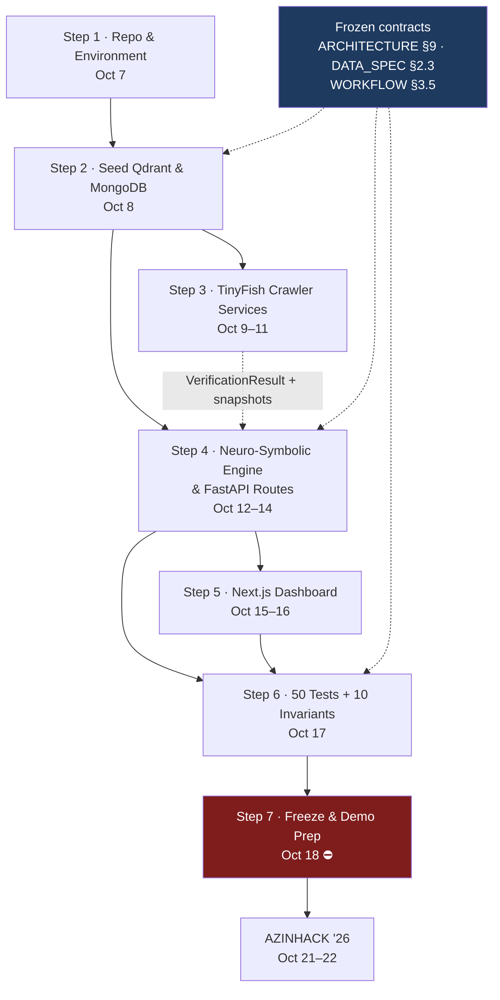

# SchemeRadar — Engineering Build Order

> **Phase 5 of 5 · Deliverable 2 of 2**
> A step-by-step roadmap for taking SchemeRadar from a frozen specification to a demonstrable, tested system before the **October 18, 2026** freeze date.

---

## Table of Contents

1. [Purpose & Constraints](#0-purpose--constraints)
2. [Timeline Overview](#1-timeline-overview)
3. [Dependency Graph](#2-dependency-graph)
4. [Step 1 — Repository & Environment Setup](#3-step-1--repository--environment-setup)
5. [Step 2 — Seed Qdrant & MongoDB](#4-step-2--seed-qdrant--mongodb)
6. [Step 3 — TinyFish Crawler Services](#5-step-3--tinyfish-crawler-services)
7. [Step 4 — Neuro-Symbolic Engine & FastAPI Routes](#6-step-4--neuro-symbolic-engine--fastapi-routes)
8. [Step 5 — Next.js Dashboard](#7-step-5--nextjs-dashboard)
9. [Step 6 — Test Suite: 50 Tests, 10 Invariants](#8-step-6--test-suite-50-tests-10-invariants)
10. [Step 7 — Freeze, Demo Prep & Rehearsal](#9-step-7--freeze-demo-prep--rehearsal)
11. [Risk Register](#10-risk-register)
12. [Scope Freeze — The "Do Not Build" List](#11-scope-freeze--the-do-not-build-list)
13. [Global Definition of Done](#12-global-definition-of-done)
14. [Demo-Day Runbook](#13-demo-day-runbook)

---

## 0. Purpose & Constraints

### 0.1 What this document is

The five-phase specification suite (`ARCHITECTURE.md` → `DATA_SPEC.md` → `WORKFLOW_AND_TESTS.md` → `PPT_SUBMISSION.md`) freezes *what* to build. This document fixes *in what order, by when, and verified how*.

### 0.2 Hard constraints

| Constraint | Value |
|---|---|
| **Specification freeze** | **October 18, 2026** (Sunday) — no architectural change after this date |
| **AZINHACK '26** | October 21–22, 2026 — USAR, GGSIPU East Delhi Campus |
| **Working days available** | **11** (Oct 7 → Oct 18), including both weekends |
| **Buffer** | Oct 19–20 (Mon–Tue) reserved for rehearsal and packaging only — **not** for new features |
| **Deliverable form** | Markdown documentation during specification; source code begins only after this Phase 5 |
| **Binding artefacts** | Phase 1 §9 (Canonical Constants Registry) and §10 (Glossary) — every step below must consume them, never redefine them |

### 0.3 Governing principles

1. **Schema before service.** Nothing is written against an unstated contract — the `Scheme` JSON Schema (DATA_SPEC §2.3) is validated in Step 2 before any route exists.
2. **Deterministic before semantic.** Build `S_det` and `P_docs` first; they are pure functions with unit-testable truth tables. Attach the LLM last, behind the `λ_llm` multiplier it is not allowed to exceed.
3. **Async before pretty.** The verification job and its SSE stream ship before any dashboard polish — the badge is the product's honesty claim.
4. **Fail-closed from day one.** The validation ladder L1–L5 (DATA_SPEC §7.4) is implemented in Step 3, not retrofitted in Step 6.
5. **One vertical slice before breadth.** Get *one* scheme end-to-end (profile → score → checklist → live verification → badge) working before seeding the catalogue.

---

## 1. Timeline Overview

| Step | Window | Days | Primary artefact | Gate |
|------|--------|------|------------------|------|
| **1 · Repository & Environment Setup** | Wed Oct 7 | 1 | Runnable skeleton, `docker compose up -d` healthy | **G1** |
| **2 · Seed Qdrant & MongoDB** | Thu Oct 8 | 1 | Collections + seeded canonical examples + BM25 cache | **G2** |
| **3 · TinyFish Crawler Services** | Fri Oct 9 – Sun Oct 11 | 3 | Tier 1/2/3 clients, validation ladder, HRQ | **G3** |
| **4 · Neuro-Symbolic Engine & FastAPI Routes** | Mon Oct 12 – Wed Oct 14 | 3 | Scoring engine + all six endpoints + SSE | **G4** |
| **5 · Next.js Dashboard** | Thu Oct 15 – Fri Oct 16 | 2 | Wizard, dashboard, checklist, live badge | **G5** |
| **6 · Test Suite** | Sat Oct 17 | 1 | 50 acceptance tests + 10 invariants green | **G6** |
| **7 · Freeze, Demo Prep & Rehearsal** | Sun Oct 18 | 1 | Frozen repo, 3-min pitch rehearsed | **G7** ⛔ |
| *Buffer* | Mon Oct 19 – Tue Oct 20 | 2 | Rehearsal, packaging, no new code | — |
| **AZINHACK '26** | Wed Oct 21 – Thu Oct 22 | 2 | Live demo + submission | — |

> ⛔ = **hard freeze.** After G7 the specification and codebase are read-only except for bug fixes that do not change a frozen constant, entity name, or test expectation.

### Critical path

`Step 1 → Step 2 → Step 4 → Step 5 → Step 6 → Step 7`

Step 3 branches off Step 2 and must merge back before Step 6. **Step 3 is the highest-variance item** (third-party browser behaviour) and is therefore scheduled earliest after the data layer.

---

## 2. Dependency Graph



**Cross-cutting work, parallel to every step:** documentation updates in `docs/`, pitch rehearsal in `docs/PPT_SUBMISSION.md`, and continuous re-running of the specification validators.

---

## 3. Step 1 — Repository & Environment Setup

**Window:** Wed Oct 7 · **Owner:** all · **Gate G1**

### 3.1 Objectives

Produce a runnable, empty skeleton where every later step has a home — and prove the infrastructure dependencies come up cleanly on the team's machines *and* in Docker.

### 3.2 Tasks

| # | Task | Notes |
|---|------|-------|
| 1.1 | Initialise the repository, `.gitignore`, branch strategy (`main` protected, `feat/*`, `fix/*`) | Do not commit secrets; `.env` is git-ignored |
| 1.2 | Create the directory skeleton from the Phase 1 module specs | `web/` · `services/api/` · `services/scoring/` · `services/tinyfish/` · `services/retrieval/` · `tools/` · `tests/` |
| 1.3 | Author `docker-compose.yml`: MongoDB, Qdrant, MinIO | Ports 27017 · 6333/6334 · 9000/9001 — **local defaults only** |
| 1.4 | Author `.env.example` with every secret the system reads | `MONGO_URI`, `QDRANT_URL`, `QDRANT_COLLECTION=schemes`, `OBJECT_STORAGE_ENDPOINT`, `TINYFISH_API_KEY`, `LLM_API_KEY`, `ADMIN_SERVICE_TOKEN` |
| 1.5 | Create the Python virtualenv + `services/api/requirements.txt` | `fastapi`, `uvicorn[standard]`, `pydantic>=2`, `qdrant-client`, `pymongo`, `rank-bm25`, `sentence-transformers`, `playwright`, `httpx` |
| 1.6 | Scaffold the Next.js 14 App Router project in `web/` with Tailwind + shadcn/ui | Node 20+, `pnpm` |
| 1.7 | Install browser binaries: `playwright install chromium` | Needed from Step 3 onward |
| 1.8 | Add the specification validators to CI (run the Phase 2/3 checks on every push) | Keeps docs and code from drifting |

### 3.3 Inputs

- `docs/ARCHITECTURE.md` §5 (Module Specifications — directory ownership), §9 (constants)
- `docs/DATA_SPEC.md` §9 (Phase 2 constants delta)

### 3.4 Outputs / Definition of Done

- [x] `docker compose up -d` starts all three services, all report **healthy**
- [x] `python -m venv .venv` activates; `pip install -r services/api/requirements.txt` completes with zero errors
- [x] `pnpm install && pnpm dev` serves a placeholder page on `localhost:3000`
- [x] `uvicorn services.api.main:app --port 8000` serves `/docs` with an empty route table
- [x] `.env.example` documented; no real secret committed
- [x] **Gate G1** — a fresh clone reproduces all of the above from the README Quickstart, unedited

### 3.5 Validation

```bash
docker compose up -d && docker compose ps      # all healthy
python -m pip check                             # no dependency conflicts
pnpm dev                                        # 3000 responds
uvicorn services.api.main:app --port 8000       # /docs responds
```

### 3.6 Risks

| Risk | Mitigation |
|---|---|
| `sentence-transformers` + `BAAI/bge-m3` model download fails or is slow on the team's network | Download once into a shared cache volume; commit a fallback instruction in the README |
| Playwright Chromium install blocked on lab machines | Fall back to Dockerised browser workers; **never** let this slip past Step 3 |
| Python 3.14 wheel incompatibility for a transitive dependency | Pin the exact versions proven to install on Oct 7 into `requirements.txt` |

---

## 4. Step 2 — Seed Qdrant & MongoDB

**Window:** Thu Oct 8 · **Owner:** data/backend · **Gate G2**

### 4.1 Objectives

Stand up the canonical data layer and prove the schema contract end-to-end **before** any service code exists. This is the cheapest possible moment to find a modelling error.

### 4.2 Tasks

| # | Task | Notes |
|---|------|-------|
| 2.1 | Convert `docs/DATA_SPEC.md` §2.3 into the runtime JSON Schema artefact | **Verbatim** — 44 required fields, `additionalProperties: false`, 26 `$defs`. No hand-edits |
| 2.2 | Author Pydantic v2 models mirroring the schema exactly | The same models power the L1–L5 validation ladder in Step 3 |
| 2.3 | Create indexes: MongoDB (unique `scheme_id`, `is_active`, `domicile_state`, `content_hash`) and Qdrant (`schemes`, 1024-dim, cosine) | Point ID = `uuid5(NAMESPACE_DNS, scheme_id)`; `scheme_id` is the payload join key |
| 2.4 | Load the two canonical instances from DATA_SPEC §4.1 and §5.1 | `sch_delhi_post_matric_scholarship_sc_st_obc_2026`, `sch_pm_kisan_samman_nidhi_2019` |
| 2.5 | Write `tools/seed.py` — validate → embed → upsert, idempotent on `content_hash` | Re-running must not duplicate |
| 2.6 | Build the Qdrant payload projection (DATA_SPEC §3.3) | Indexable: `domicile_state`, `category`, `scheme_type`, `department`, `fiscal_year`, `is_active`, `verification_status` |
| 2.7 | Build the in-memory BM25 index over the same corpus | `k1 = 1.2`, `b = 0.75`; version stamp; rebuildable cache |
| 2.8 | Create the auxiliary collections | `scheme_revisions`, `verification_logs`, `citizen_profiles`, `ingestion_audit` |

### 4.3 Inputs

- `docs/DATA_SPEC.md` §2.3 (schema), §2.4 (V-CF1…V-CF12), §2.5 (document penalty table), §3 (DTOs), §4 & §5 (examples), §8 (auxiliary collections)

### 4.4 Outputs / Definition of Done

- [x] Both canonical instances **validate against the JSON Schema** and all 12 cross-field invariants pass
- [x] Qdrant returns both points on a filtered query; BM25 returns both on a lexical query (`"post matric"`, `"kisan"`)
- [x] `content_hash` unchanged ⇒ re-seed is a no-op
- [x] **Gate G2**

> **Scope note — score proofs live in Step 4.** End-to-end score assembly
> (**0.887 / HIGH**, **0.688**, **0.988**) is **deferred to Step 4, Gate G4
> (§6.5)**. It needs `S_det` from the Deterministic Rule Evaluator, `S_hybrid`
> from hybrid fusion and `P_docs` from the Document Friction Penaltizer — all
> produced by `services/scoring/` (tasks 4.x), which does not exist until
> Step 4. Step 2 proves the **data layer** only: schema contract, storage,
> idempotent seeding and lexical/vector recall. See §6.5 for the score DoD.

### 4.5 Validation

```bash
python -m tools.validate_examples    # JSON Schema + V-CF1..V-CF12 on both instances
python -m tools.seed --dry-run       # "2 to insert, 0 to update"
python -m tools.build_bm25           # version stamp printed
```

### 4.6 Risks

| Risk | Mitigation |
|---|---|
| Encoding damage to ₹ figures / Devanagari during seed | Assert round-trip of `₹2,50,000`, `₹6,000`, `₹48,000` byte-for-byte after load |
| Embedding the wrong text fields | Embed exactly `name + " " + department + " " + benefits_text + " " + eligibility_text` (Phase 1 §5.3.1); assert vector dimension 1024 |
| Schema/code drift later | Generate the Pydantic models from the JSON Schema in CI and fail on diff |

---

## 5. Step 3 — TinyFish Crawler Services

**Window:** Fri Oct 9 – Sun Oct 11 (3 days) · **Owner:** integrations · **Gate G3**

> **Scheduled early deliberately.** Third-party browser behaviour is the highest-variance unknown. Surfacing it on day 3 leaves 7 days of recovery.

### 5.1 Objectives

Implement the single façade `services/tinyfish/` with exactly three typed clients, the fail-closed ingestion pipeline, and live portal verification producing immutable evidence.

### 5.2 Tasks

| # | Task | Day | Notes |
|---|------|-----|-------|
| 3.1 | Build the gateway façade + SSRF guard | Oct 9 | `http/https` only, `*.gov.in` / `*.nic.in` + state allowlist, block private IPs and metadata endpoints |
| 3.2 | **Tier 1 — `TinyFishSearchClient`** | Oct 9 | `discover(queries, recency_window) → SearchHit[]`; ingestion-only; writes `ingestion_audit` |
| 3.3 | **Tier 2 — `TinyFishFetchClient`** | Oct 9–10 | `render(url, timeout) → FetchResult{markdown, final_url, status}`; budget 8,000 ms; 3 retries → `fetch_unreachable` |
| 3.4 | LLM Structured Schema Parser + prompt (DATA_SPEC §7.2) | Oct 10 | Schema-anchored extraction with **field-level provenance**; portal Markdown is untrusted input |
| 3.5 | Validation ladder **L1–L5** + `parse_provenance` sidecar | Oct 10 | One repair attempt, then **Human Review Queue**; L4 (SSRF) and L5 (`parse_confidence < 0.75`) **never** retry |
| 3.6 | HRQ write path — `index_state = "pending_review"`, `is_active = false` | Oct 10 | Must be absent from Qdrant **and** BM25 |
| 3.7 | **Tier 3 — `TinyFishWebAgentClient`**: the 18-step algorithm (WORKFLOW §2.3) | Oct 10–11 | Navigate → dismiss popups → detect **enabled** submit → parse/normalise dates → classify → snapshot → verdict |
| 3.8 | Date parsing & normalisation (WORKFLOW §2.4) and the 9-row verdict precedence table (§2.5) | Oct 11 | First match wins |
| 3.9 | Snapshot writer → `snapshots/{scheme_id}/{job_id}.png`, 90-day lifecycle, `verified_at` server-generated | Oct 11 | Immutable; signed URL issuance |
| 3.10 | `verification_logs` insert on every run + budget enforcement (4,000 ms/portal, concurrency 3) | Oct 11 | |
| 3.11 | Degradation fallbacks for all three tiers (Phase 1 §8.2) | Oct 11 | Tier 3 down ⇒ `UNVERIFIED` + last-known |

### 5.3 Inputs

- `docs/ARCHITECTURE.md` §7 (3-tier), §5.5 (façade boundary rule), §8.2 (degradation)
- `docs/DATA_SPEC.md` §7 (extraction pipeline), §6 (verification state variants)
- `docs/WORKFLOW_AND_TESTS.md` §2 (agent algorithm, dates, verdicts, freshness)

### 5.4 Outputs / Definition of Done

- [ ] No module outside `services/tinyfish/` imports a TinyFish endpoint — **enforced by a lint rule**
- [ ] Ladder rejects all seven DATA_SPEC §7.5 failure cases, routing each to HRQ with the specified retry policy
- [ ] Tier 3 successfully verifies a live `gov.in` portal and writes a retrievable snapshot
- [ ] `observed_signals[]` populated; verdict matches the precedence table for at least 3 real portals
- [ ] SSRF unit test: `https://169.254.169.254/` rejected at L4 with **no** repair attempt (TC-17)
- [ ] Disabling Tier 3 leaves the ingestion path and scoring unaffected
- [ ] **Gate G3**

### 5.5 Validation

| Test | Expectation |
|---|---|
| TC-02 | `"income_ceiling_annual": "Rs 2.5 lakh"` → L2 violation → 1 repair → **HRQ, not indexed** |
| TC-17 | `guide_url = https://169.254.169.254/` → L4, **no retry** → HRQ |
| TC-03…TC-04 | `parse_confidence < 0.75` → HRQ; scheme absent from Qdrant |
| Edge Case C (TC-C1…TC-C11) | Portal 5xx/WAF/captcha → `UNREACHABLE`/`BLOCKED`, snapshot captured, score unchanged |

### 5.6 Risks

| Risk | Mitigation | Contingency |
|---|---|---|
| Target portal blocks cloud browsers (WAF/captcha) | Classify per the verdict table rather than fighting the WAF | Ship with `UNREACHABLE`/`BLOCKED` honestly displayed — **it still scores points for integrity** |
| Tier-3 latency blows the 4,000 ms budget | Hard timeout at 4,000 ms; verify only top-5, concurrency 3 | Verified payload degrades to 6,000 ms→`PENDING` badge, never blocks sync |
| LLM parser hallucinates enum values | L2 enum whitelist + fail-closed | Use the two canonical examples as golden fixtures |
| Oct 11 slips | **Cut scope from here, not from Step 6** | Ship Tier 1+2 complete, Tier 3 with a reduced portal set |

---

## 6. Step 4 — Neuro-Symbolic Engine & FastAPI Routes

**Window:** Mon Oct 12 – Wed Oct 14 (3 days) · **Owner:** backend/ML · **Gate G4**

> **This is the core.** It gets a full three days and the strongest guardrails. Step 5 must not start until G4 is green.

### 6.1 Objectives

Implement `services/scoring/` as four pure sub-modules, wire retrieval fusion behind them, and expose all six endpoints with the SSE stream and the latency budgets enforced.

### 6.2 Tasks — Scoring Engine (`services/scoring/`)

| # | Task | Notes |
|---|------|-------|
| 4.1 | **Deterministic Rule Evaluator** — the 7 hard gates as a boolean expression tree | Pure, side-effect-free. Emits `S_det ∈ {0,1}` + `gate_trace[]` (`{gate, pass, observed, required}`) |
| 4.2 | **`domain_gates` generalisation** (DATA_SPEC §0.3) — e.g. PM-Kisan 2 ha | Indicator product is *generalised*, not replaced — reduction-safe |
| 4.3 | **Near-miss detection** — `δ_income = 0.05` (5%), `δ_age = 365 days` | `S_det = 0` ⇒ `Score := 0`, `band := NEAR_MISS`, **assembler never runs** |
| 4.4 | **Hybrid retrieval** — dense top-50 + BM25 top-50 → **RRF `k = 60`** → fused top-30 | Linear mode available with `α = 0.60`; filters applied **after** fusion |
| 4.5 | **Semantic Auditor** — top-10 to the LLM → `λ_llm ∈ {1.0, 0.6, 0.2}` + `semantic_notes[]` | Timeout ⇒ `λ_llm := 1.0`, `auditor_unavailable`. **Cannot touch `S_det`** |
| 4.6 | **Document Friction Penaltizer** — tier diff with `charged_weight` resolution (DATA_SPEC §2.5.1) | `P_docs = min(0.60, Σ p(d)·w_req(d))`; emits `missing_documents[]` |
| 4.7 | **Score Assembler** — `clamp(0.60·S_det + 0.40·S_sem − P_docs, 0, 1)`, band assignment, `score_breakdown` | Bands: HIGH ≥0.80 · MEDIUM ≥0.60 · LOW ≥0.30 · SUPPRESSED <0.30 |

### 6.3 Tasks — API Gateway (`services/api/`)

| # | Endpoint | Budget | Notes |
|---|---|---|---|
| 4.8 | `POST /api/v1/profile/qualify` | **≤ 1,200 ms p95** | Validate → dense → sparse → fuse → rules → LLM audit → assemble |
| 4.9 | `GET /api/v1/schemes/{scheme_id}` | — | Canonical record |
| 4.10 | `POST /api/v1/verify/{scheme_id}` | async | Enqueues Tier-3 job; returns `job_id` |
| 4.11 | `GET /api/v1/verify/stream/{job_id}` | **≤ 6,000 ms p95** to completion | SSE `VerificationEvent`s → badge |
| 4.12 | `GET /api/v1/checklist/{scheme_id}` | — | **Bridge the Gap Checklist**, all 8 construction rules (WORKFLOW §1.5) |
| 4.13 | `POST /api/v1/admin/ingest/refresh` | protected | Requires `ADMIN_SERVICE_TOKEN` |
| 4.14 | Orchestrator control flow | — | Parallel fan-out, per-stage timeouts, `trace_id` propagation |
| 4.15 | Rate limiting + PII handling | — | Profiles processed in-memory; `citizen_profiles` persistence **opt-in**; store `aadhaar_in_hand` boolean only |
| 4.16 | Degradation paths (Phase 1 §8.2) | — | Qdrant down → BM25-only + `degraded`; downstream timeout → partial results with `PENDING`, **never a 5xx** |
| 4.17 | Observability | — | p50/p95 per stage, ingestion success rate, `verification_status` distribution, near-miss rate, mean `P_docs`, TinyFish call counts/latency per tier |

### 6.4 Inputs

- `docs/ARCHITECTURE.md` §4 (query flow), §5.2/§5.4 (module contracts), §6 (full formulation), §8.1 (budgets)
- `docs/DATA_SPEC.md` §3.1–§3.2 (DTOs), §2.5 (penalty table), §0 (consistency crosswalk)
- `docs/WORKFLOW_AND_TESTS.md` §1.5 (checklist rules), §3.5 (invariants)

### 6.5 Outputs / Definition of Done

- [ ] Rule Evaluator is a **pure function**: identical inputs ⇒ identical `S_det` and byte-identical `gate_trace`
- [ ] Score reproduces exactly: **0.887**, **0.987**, **0.787**, **0.688**, **0.988**, **0.737**
- [ ] **I-1 … I-10** all pass as executable assertions
- [ ] Every response carries a complete `score_breakdown`
- [ ] p95 sync ≤ **1,200 ms** and verified ≤ **6,000 ms** measured against local seeds
- [ ] LLM disabled ⇒ service still returns correct scores with `auditor_unavailable`
- [ ] Qdrant stopped ⇒ service returns BM25-only with `degraded: dense_unavailable`
- [ ] **Gate G4**

### 6.6 Validation

| Test | Expectation |
|---|---|
| TC-05 | All 7 gates pass → `S_det=1`, `P_docs=0`, `Score ≤ 1.0`, never negative |
| TC-07 | `S_sem=0`, `P_docs=0.60` → `Score = 0.00` → `SUPPRESSED` |
| TC-09 | LLM `NO_MATCH` → `λ_llm = 0.2`; `S_det` and `gate_trace` **unchanged** |
| TC-B* | ₹2,55,000 vs ₹2,50,000 → `NEAR_MISS`, shown separately with the exact violation |
| TC-01…TC-08 | Scoring block, full table in WORKFLOW §3.4 |

### 6.7 Risks

| Risk | Mitigation |
|---|---|
| LLM latency eats the 1,200 ms budget | Budget 900 ms; **batch one call for the top-10** (not 30 calls); hard timeout → `λ_llm := 1.0` |
| Score drift from the published proofs | Golden tests assert exact values, not tolerances |
| Near-miss leakage into the primary feed | I-1 as a blocking test; assembler guarded by a branch, not a post-hoc filter |
| SSE stalls on slow portals | Hard 6,000 ms budget; emit `PENDING` then close cleanly |

---

## 7. Step 5 — Next.js Dashboard

**Window:** Thu Oct 15 – Fri Oct 16 (2 days) · **Owner:** frontend · **Gate G5**

### 5.1 Objectives

Build the citizen-facing experience as a **pure display layer** — it renders server-computed truth and owns no eligibility logic whatsoever (Phase 1 §5.1 *Must NOT own*).

### 7.2 Tasks

| # | Task | Notes |
|---|------|-------|
| 5.1 | **Profile Wizard** (WORKFLOW §1.2) | Age, gender, domicile, education lattice, income, social category, minority, occupation, `documents_in_hand[]` |
| 5.2 | **Scheme Dashboard** (§1.4) | Ranked cards: `Score`, `band`, `gate_trace` observed-vs-required, verification badge |
| 5.3 | **Near-miss section** | Rendered *separately* with the exact violation text — never mixed into the eligible feed |
| 5.4 | **Bridge the Gap Checklist** (§1.5) | Ordered by score gain; each row shows authority, guide URL, tier, `score_if_completed`, charged weight; all 8 construction rules |
| 5.5 | **Verification badge** — the 7-row state table (§1.6) | Read-time freshness rules; `verified_at` age; **never fabricate a green tick** |
| 5.6 | **SSE client** for `/verify/stream/{job_id}` | On drop: show last-known status + age, never assume `Verified` |
| 5.7 | Empty & error states (§1.8) | No results · `degraded` flag · `SUPPRESSED` behind *"Show all eligible"* · network failure |
| 5.8 | Return visits (§1.7) | Re-qualification; previously applied schemes |
| 5.9 | ₹ currency + date locale formatting, i18n scaffolding | `name_hi` strings reserved; Hindi voice agent is **out of scope** for freeze |
| 5.10 | Latency budget | First meaningful paint ≤ 1,500 ms; never block render on verification |

### 7.3 Inputs

- `docs/WORKFLOW_AND_TESTS.md` §1 (the entire citizen UX workflow)
- `docs/DATA_SPEC.md` §3.1 (ProfileContext), §3.2 (SchemeMatch)

### 7.4 Outputs / Definition of Done

- [ ] **I-8**: no eligibility computation in the client — grep-clean for scoring formulas in `web/`
- [ ] All badge states reachable and correct, including `UNVERIFIED` with an age
- [ ] Checklist reproduces the Phase 3 worked outputs (Ananya's `score_if_completed = 0.987`, Ramesh's `+0.30`)
- [ ] SSE disconnect mid-verification leaves a truthful badge, not a blank one
- [ ] Profile wizard completes in ≤ 60 seconds (measured)
- [ ] **Gate G5**

### 7.5 Risks

| Risk | Mitigation |
|---|---|
| Pressure to "improve" a score client-side | I-8 is a blocking test; the client is a renderer |
| Badge shown as verified after SSE drop | Read-time rule: render age, never trust last-known `VERIFIED` past 60 minutes |
| Scope creep into voice/Hindi/form-fill | Explicitly on the Do-Not-Build list (§11) |

---

## 8. Step 6 — Test Suite: 50 Tests, 10 Invariants

**Window:** Sat Oct 17 · **Owner:** all · **Gate G6**

### 8.1 Objectives

Execute the frozen acceptance suite from `docs/WORKFLOW_AND_TESTS.md` §3.4–§3.5 against the integrated system. This is a **gate**, not an exploration — any red test blocks the freeze.

### 8.2 Tasks

| # | Task | Coverage |
|---|------|----------|
| 6.1 | Run `TC-A1…TC-A7` | Edge Case A — document friction & self-declared alternatives |
| 6.2 | Run `TC-B1…TC-B10` | Edge Case B — borderline income, `NEAR_MISS` routing |
| 6.3 | Run `TC-C1…TC-C11` | Edge Case C — portal down / WAF / captcha |
| 6.4 | Run `TC-01…TC-22` | Cross-cutting: scoring, retrieval, ingestion, API, security, UX |
| 6.5 | Assert **I-1 … I-10** as executable invariants | See README for the full list |
| 6.6 | Regression: re-run the specification validators | Phase 2/3/4 checks must stay green after code changes |
| 6.7 | Load smoke: 50 concurrent `/profile/qualify` | Confirm p95 ≤ 1,200 ms; no unbounded queue growth |
| 6.8 | Failure-injection pass | Kill Qdrant, kill the LLM, kill Tier 3 — confirm the degradation matrix row-by-row |
| 6.9 | Triage & fix — **no new features** | Every fix must be a bug against an existing frozen expectation |

### 8.3 Outputs / Definition of Done

- [ ] **50/50 acceptance tests pass**
- [ ] **10/10 invariants hold**
- [ ] Degradation matrix verified for Qdrant, BM25, LLM, TinyFish ×3, MongoDB
- [ ] No frozen constant, entity name or formula was changed to make a test pass — **if it was, the spec or the code is wrong and must be reconciled explicitly, then re-validated**
- [ ] **Gate G6**

---

## 9. Step 7 — Freeze, Demo Prep & Rehearsal

**Window:** Sun Oct 18 · **Owner:** all · **Gate G7** ⛔

### 9.1 Tasks

| # | Task |
|---|------|
| 7.1 | Tag `v1.0-spec-frozen`; protect `main`; open `fix/*` only |
| 7.2 | Final pass: all five specification documents internally consistent; validators green |
| 7.3 | Record demo evidence: screenshots of Ananya (0.887/HIGH), Ramesh (0.688→0.988), the borderline `NEAR_MISS`, and a real snapshot from Tier 3 |
| 7.4 | Prepare a **offline fallback** for the demo: pre-recorded verification run + seeded fixtures, in case live portals block the venue network |
| 7.5 | Rehearse the 180-second pitch from `docs/PPT_SUBMISSION.md` §6 — three clean runs under time |
| 7.6 | Prepare Q&A from the deck's crib sheet; assign who answers which rubric row |
| 7.7 | Export the deck; back up the repo; verify the README Quickstart on a clean machine |
| 7.8 | **Freeze** |

### 9.2 Buffer — Mon Oct 19 & Tue Oct 20

**Rehearsal and packaging only.** Permitted: bug fixes that restore an already-frozen behaviour, slide edits, runbook updates. **Forbidden:** new endpoints, new documents, new constants, refactors.

### 9.3 Outputs / Definition of Done

- [ ] Frozen tag exists; spec validators green; demo runs twice without intervention
- [ ] Offline fallback demonstrated working
- [ ] 3/3 pitch rehearsals under 3:00
- [ ] **Gate G7** ⛔

---

## 10. Risk Register

| # | Risk | Likelihood | Impact | Owner | Mitigation / Trigger |
|---|------|-----------|--------|-------|----------------------|
| R1 | Tier-3 verification blocked by WAF/captcha on target portals | High | Medium | Integrations | Classify honestly (`BLOCKED`) + snapshot as evidence. Trigger: >50% of top portals blocked by Oct 11 → reduce the verified set, keep badge truthful |
| R2 | LLM latency breaks the 1,200 ms sync budget | Medium | High | Backend | Top-10 batching, 900 ms hard timeout, degrade to `λ_llm = 1.0`. Trigger: p95 > 1,400 ms on Oct 13 → drop to retrieval-only for the sync path |
| R3 | Score drift vs published proofs (0.887 / 0.688 / 0.988) | Medium | **Critical** | Backend | Golden tests assert exact values. Trigger: any mismatch → stop and reconcile spec vs code, never fudge a constant |
| R4 | Embedding model unavailable/slow on demo hardware | Medium | Medium | Data | Cache the model locally; BM25-only fallback is already specified. Trigger: load > 2 s → pre-warm at service start |
| R5 | Team bandwidth lost to Step 3 overrun | Medium | High | Lead | **Cut scope from Step 5, never from Step 6.** A thin dashboard with 50 green tests beats a rich one with red tests |
| R6 | Spec/code drift discovered late | Medium | High | All | Run spec validators in CI from Step 1; any drift blocks merge |
| R7 | Venue network blocks government portals | High | Low | Integrations | Offline demo bundle (R7 mitigation shipped with 7.4) |
| R8 | Scope creep (voice, Hindi, DigiLocker, form-fill) | High | Medium | Lead | Enforced by the Do-Not-Build list, §11 |

---

## 11. Scope Freeze — The "Do Not Build" List

**Not before October 18.** These are designed and documented as *Future Scope* (Deck Slide 9) — attempting them is the single most likely cause of a failed submission.

- ❌ **DigiLocker integration** — `documents_in_hand` is entered manually for the demo
- ❌ **Hindi voice agent** — i18n strings are scaffolded only (`name_hi` reserved)
- ❌ **Automated form-filling** — *"we pre-fill, the human submits"* is a future-scope claim, not a demo feature
- ❌ **Full central + state catalogue ingestion** — the two canonical examples plus a small seed are sufficient; catalogue breadth is labelled a **design capacity / target**
- ❌ **User accounts, auth providers, profiles dashboard** — `citizen_profiles` is opt-in and unused in the demo
- ❌ **Horizontal scaling work** — single-node is explicitly in scope (Deck Slide 8)
- ❌ **Any change to a Phase 1 §9 constant or §10 entity name**

---

## 12. Global Definition of Done

The submission is ready only when **all** of the following hold:

**Correctness**
- [ ] 50/50 acceptance tests pass · 10/10 invariants hold
- [ ] Published scores reproduce exactly: 0.887, 0.987, 0.787, 0.688, 0.988, 0.737
- [ ] `S_det = 0` ⇒ `NEAR_MISS`, assembler skipped, shown separately
- [ ] LLM and Qdrant both disabled ⇒ system still answers correctly (degraded)

**Honesty**
- [ ] No badge shown as *Verified* beyond 60 minutes
- [ ] Portal failure never moves a score by 0.001
- [ ] Unparseable schemes are absent from the index, never approximated
- [ ] Coverage claims labelled as *design capacity / target*, not achieved

**Operability**
- [ ] README Quickstart works from a clean clone on a clean machine
- [ ] `docker compose up -d` → seeded → serving in one documented sequence
- [ ] Offline demo fallback proven

**Consistency**
- [ ] Specification validators green across all five documents
- [ ] No non-`.md` artefact left in the specification workspace
- [ ] Frozen constants and entity names used verbatim everywhere

**Presentation**
- [ ] 3 × 180-second rehearsals completed under time
- [ ] Deck, pitch script and this roadmap agree on every number

---

## 13. Demo-Day Runbook

| Phase | Action | Fallback if it fails |
|---|---|---|
| **T−60 min** | `docker compose up -d` → seed → API → dashboard; smoke-test `/profile/qualify` | Use the pre-seeded snapshot volume |
| **T−30 min** | Live Tier-3 verification against a known `gov.in` portal; confirm snapshot written | Play the pre-recorded verification run |
| **0:00–0:25** | **Hook** — ₹1.4 lakh crore, 65% unclaimed (Slide 1) | — |
| **0:25–0:55** | **Problem** — fragmentation, legalese, ghost links | — |
| **0:55–1:30** | **Solution** — profile → hybrid retrieval → neuro-symbolic formula (Slides 2→4) | — |
| **1:30–2:05** | **TinyFish** — Search, Fetch, Web Agent + 60-minute rule (Slide 6) | — |
| **2:05–2:40** | **Proof** — Ananya 0.887, Ramesh +0.30, borderline 5,000 over (Slide 3) | — |
| **2:40–3:00** | **Impact + Close** — 50 tests, 10 invariants, fail-closed, the ask (Slides 7→9) | — |
| **Q&A** | Deflect to the crib sheet rows; label every projection honestly | — |

---

### Document Control

| Field | Value |
|-------|-------|
| Phase | 5 of 5 |
| File | `docs/BUILD_ORDER.md` |
| Paired deliverable | [`README.md`](../README.md) (root landing page) |
| Predecessors | `docs/ARCHITECTURE.md` · `docs/DATA_SPEC.md` · `docs/WORKFLOW_AND_TESTS.md` · `docs/PPT_SUBMISSION.md` |
| Binding inputs | Phase 1 §9 Canonical Constants Registry · Phase 1 §10 Glossary · Phase 3 §3.4–§3.5 test matrix and invariants |
| Freeze date | **October 18, 2026** |
| Event | AZINHACK '26 — October 21–22, 2026, USAR GGSIPU East Delhi Campus |
| Status | **Specification suite complete — 5 of 5 phases delivered.** |
